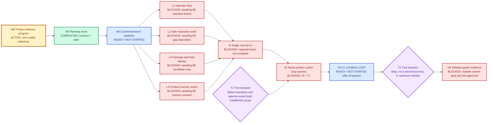

# Usable Product Milestone

This is the only active Harness Ultragoal ExecPlan. It implements the planning
contract in `GOAL_CONTRACT.md` and stays current as work proceeds.

## Purpose and observable outcome

Deliver `CL-USABLE-LOOP`: one exact current-source candidate is packaged,
installed in an authorized local scope, discovered by the supported host, and
used on a Tree-selected representative repository to fit safely, run useful
dirty-tree affected work, diagnose a representative failure, recover, and
repeat useful work.

The first value event is an operator receiving a useful verified repository
result while unrelated work remains unchanged and the product explains what
ran, what did not run, why, and what to do next.

This plan does not authorize product implementation today, local installation,
target-repository writes, external effects, publication, destructive
retirement, credentials, or release.

## Current status

- Planning and goal-contract reset: completed by the commit that adds this plan.
- Product delivery program: active.
- Current-behavior baseline: ready and not started.
- Product implementation lanes: blocked on the baseline and shared-interface
  freeze.
- Root fan-in: blocked on accepted required lanes.
- Product milestone journey: blocked on fan-in plus Tree's target/install/write
  authorization.
- Release: outside the current milestone and blocked on a later Tree decision.

Historical v2 lane, backlog, completion, acceptance, review, receipt, and
mandatory-law proof projections are non-current compatibility inputs. Do not
refresh them.

## Dependency and status graph

Status is written in every node so the graph remains understandable without
color.



### Legend

| Color | Status | Meaning |
| --- | --- | --- |
| Green | `COMPLETED` | Accepted plan work whose declared output exists |
| Amber | `ACTIVE` | Current program or lane consuming work and budget |
| Blue | `READY / NOT STARTED` | Legal next work with satisfied dependencies |
| Red | `BLOCKED` | Cannot start; the node states the exact cause |
| Purple | `TREE DECISION` | Value, authority, risk, or external-effect choice with no agent-safe default |

## Context and orientation

Harness Ultragoal has two product surfaces:

- the Codex plugin front door, skills, and installation metadata; and
- the typed Rust CLI that owns deterministic inspection, repository fitting,
  routine checks, diagnosis, recovery, package operations, and machine output.

The existing architecture and protected invariants remain useful. The failure
was control topology: the project treated the broadest proof system as the
ordinary development loop and made its own stale receipts recurring inputs.
This plan uses the smallest sufficient topology instead:

1. one read-only baseline;
2. at most four disjoint implementation lanes;
3. one root fan-in;
4. one same-surface product journey; and
5. an optional later release decision.

## Progress

- [x] Inspect current goal contracts, root planning law, active plans, historical
  receipts, tooling documentation, product contracts, architecture, security,
  reliability, and Agentic Engineering guidance.
- [x] Replace the 14-claim current goal with `CL-USABLE-LOOP`.
- [x] Replace overlapping active plans with this plan.
- [x] Define finite gates, proof tiers, evidence retention, cost routing, repair
  budgets, stop rules, lane ownership, fan-in, and Tree decisions.
- [ ] B0: establish current behavior and freeze shared contracts.
- [ ] L1-L4: run only the required implementation lanes.
- [ ] I0: integrate once at the root.
- [ ] T1: obtain Tree's exact repository/install/write authorization.
- [ ] J0: run the product journey and decide `CL-USABLE-LOOP`.

## Lane map

All write lanes start from the exact integrated B0 commit in isolated
worktrees. Paths are exclusive. A lane may inspect any repository path but may
write only its owned paths. Shared-path changes are requests to I0.

| Lane | Owner and route | Exclusive write ownership | Depends on | Local oracle | Budget and stop |
| --- | --- | --- | --- | --- | --- |
| B0 Current behavior | Root, read-only; Sol only for final ambiguity | No product writes; may update this plan with observed dispositions | R0 | Candidate identity, public command map, focused existing tests, and per-surface `no_change` / `partial_change` / `change_required` / `blocked` | One work session; stop if a required tool or current candidate cannot be identified |
| L1 Operator flow | One Terra implementation owner | `skills/`, `docs/plugin-resource-map.md`, `docs/install-and-visibility.md`; shared manifest, README, parser, and public dispatch remain I0-owned | B0 | Fresh-agent route comprehension plus focused skill/reference checks | Two repair attempts; stop on shared grammar or product-value decision |
| L2 Safe repository work | One Terra owner; Sol review only if authority/custody changes | `validator/src/repository_fit/`, `validator/src/routine_work/`, and their domain-local tests | B0 | Fit and routine behavior, dirty-tree preservation, failure, interruption, and recovery checks for the changed boundary | Two repair attempts; stop on ambiguous post-effect state or root issuer change |
| L3 Package and host identity | One Terra owner; Sol review for install/effect authority | `validator/src/distribution/`, `validator/src/plugin_product/agent_discovery/`, `install/`, and domain-local tests | B0 | Deterministic package/install-test plus distinct package, installed, discovery, and runtime identities | Two repair attempts; no personal install, registry mutation, credentials, or network without Tree authority |
| L4 Product journey oracle | One Terra owner; independent of L1-L3 implementation | `fixtures/product-delivery/`, `validator/tests/product_delivery/`, and the future milestone outcome template | B0 | The oracle fails before missing product behavior and distinguishes preservation, diagnosis, recovery, useful outcome, and forbidden substitutions | One oracle design plus one correction; stop if the representative job cannot be graded without Tree input |
| I0 Root fan-in | Root Sol integrator; no worker consensus | `.codex-plugin/`, `README.md`, public parser/dispatch, shared schemas, dependencies, migrations, generated authority, and claim decisions | Required accepted L1-L4 lanes | Dependency-order merge, shared wiring, integrated focused checks, ownership audit, and exact candidate freeze | One fan-in plus one correction cycle; stop on unresolved semantic conflict or missing required lane |
| J0 Product journey | Root operator with independent observer | No source edits; authorized install and target-repository effects only | I0 and T1 | Exact installed-candidate journey on Tree-selected repository | One journey plus one repair cycle; stop on unsafe ambiguity, authorization gap, or failure without a new causal hypothesis |

Lanes that B0 classifies `no_change` do not launch. Their existing behavior is
checked again only at I0 if the integrated candidate consumes it.

## B0 concrete steps

B0 is observational and does not run the retired UltraGoal governance loop.

1. Confirm clean branch, commit, and worktree state.
2. Record the current package identity and public CLI grammar from source.
3. Run the narrowest existing compile and focused tests needed to determine
   whether L1-L4 have real implementation gaps.
4. Compare current behavior with the `CL-USABLE-LOOP` sequence.
5. Update this plan's lane states and decision log.
6. Freeze the public requests and shared types workers may consume.

Candidate commands, subject to current repository truth:

```text
git status --short --branch
git rev-parse HEAD^{commit} HEAD^{tree}
cargo check -p ultragoal --offline
cargo test -p ultragoal --test cli_contract --offline
cargo test -p ultragoal --test repository_fit_live_journeys_contract --offline
cargo test -p ultragoal --test routine_recovery_reuse_journey_contract --offline
cargo test -p ultragoal --test distribution_contract --offline
```

A missing selector or unavailable tool is a B0 finding, not permission to
invent a substitute or run every test.

## Delegation and handoff contract

Each launched lane receives:

- objective and local acceptance;
- exact base commit;
- owned and forbidden paths;
- consumed shared contract;
- declared risk and proof tier;
- commands and environment;
- model/reasoning selection and budget when exposed;
- stop and escalation conditions; and
- one return envelope.

The return envelope is a concise message, not a durable receipt by default:

- lane and commit;
- changed owned paths;
- focused commands and outcomes;
- relevant failure-path evidence;
- requested shared changes;
- residual risk and claim ceiling;
- clean/dirty status; and
- next root action.

## Fan-in contract

I0 is the only integration point.

1. Validate or explicitly waive every expected lane.
2. Reject ownership overlap and undeclared shared edits.
3. Merge accepted lanes in dependency order.
4. Resolve contradictions against current source and the frozen contract.
5. Apply shared grammar, manifest, schema, migration, and generated-authority
   changes at root.
6. Run integrated checks selected for the changed surfaces.
7. Freeze one exact candidate for J0.
8. Close, cancel, or retain each worktree according to its unique-state need.

If a lane fails, I0 either omits it after B0 proves it unnecessary, returns one
bounded correction, or blocks the dependent milestone. There is no quorum for
correctness-critical behavior.

## Validation and acceptance

### Ordinary lane

- focused changed-behavior checks;
- failure path when touched;
- clean diff and committed handoff;
- no durable receipt unless the handoff cannot be reconstructed.

### High-risk boundary

Required only when security, permission, authority, custody, concurrency,
recovery, migration, or external effects change:

- explicit failure and misuse model;
- relevant negative, fault, race, rollback, or recovery evidence;
- one independent focused reviewer who did not implement the change;
- candidate-bound decision and one correction budget.

### Product milestone

- exact source/package/install/discovery/runtime identity chain;
- Tree-authorized representative repository and write scope;
- useful dirty-tree outcome;
- representative failure, diagnosis, and recovery;
- unrelated-state preservation;
- time to verified value, human interventions, recovery result, and retained
  artifact cost;
- independent observation sufficient to decide `CL-USABLE-LOOP`.

### Release

Not part of this plan. Release requires T2 plus fresh release-specific security,
distribution, rollback, migration, and human approval. J0 cannot auto-promote
to release.

## Evidence retention and invalidation

Focused command output is ephemeral. Retain only:

- the final `CL-USABLE-LOOP` milestone outcome;
- an irreproducible install/host observation needed for that decision;
- security, custody, or recovery state needed to resume safely; or
- a cross-process handoff that cannot be reconstructed from the commit and
  tests.

Every retained item declares claim, owner, candidate/environment, invalidation,
and deletion. It invalidates only on a consumed authority change, relevant
environment change, explicit freshness expiry, or contradictory same-surface
observation. Unrelated edits and age alone do not trigger refresh.

Historical v2 artifacts remain frozen until B0 identifies current readers and
the future retirement work proves deletion safe. Their staleness does not block
L1-L4 or cause reproof.

## Idempotence and recovery

- Re-run B0 only after authority-bearing baseline inputs change or a current
  observation contradicts it.
- Reuse one worktree per lane across its bounded repair cycle.
- Never repair, reset, stash, or rebase a dirty lane from root.
- After interruption, inspect branch, worktree, commit, status, and unique
  uncommitted state before resuming.
- Cancel downstream work when its frozen shared contract changes.
- Delete reproducible targets, caches, and scratch state after fan-in; retain
  only classified unique recovery evidence.

## Tree decisions and approvals

| Decision | Needed when | Current status | Effect if absent |
| --- | --- | --- | --- |
| T1 Representative repository | Before J0 | Needed later | J0 and `CL-USABLE-LOOP` remain blocked; implementation may continue |
| T1 Local install and repository-write scope | Before J0 | Needed later | No personal install, host mutation, or target write |
| T2 Stop, second journey, or release | After J0 | Not yet due | Goal stops at the usable milestone |
| Publication, credentials, destructive retirement | Only if separately requested | Not authorized | Affected action remains forbidden |

## Repair and stop policy

Each lane gets at most two repair attempts. The second attempt must name a new
causal hypothesis or stronger oracle. After that, return `blocked` with the
smallest missing decision or capability.

Stop the affected boundary for authority gaps, secret risk, shared ownership
conflict, ambiguous post-effect state, budget exhaustion, or a value/risk
decision with no safe default. Continue independent legal work. Never keep the
program active merely to refresh evidence or satisfy an old receipt schedule.

## Surprises and discoveries

- The current worktree began detached even though the task required a commit;
  the reset created `codex/ultragoal-product-delivery-reset` before edits.
- The historical current-state system named 18 blocked lanes and 14 withheld
  claim rows while its own plan identified the same installed useful loop as
  the nearest product milestone.
- Recent source history removed disconnected legacy production graphs, while
  active planning and receipt projections still described them. B0 must inspect
  current source rather than reconstruct those historical plans.
- Legacy mandatory-law policy and audit projections still bind broad receipt
  surfaces and deleted plan names. They remain frozen migration inputs for this
  goal; B0 records any current product reader, and a later root-owned retirement
  change must update or remove those readers without laundering that work into
  an ordinary product gate.
- Current schemas and validator source also enumerate some deleted plan names.
  This is a named compatibility blocker for the repository-wide check, not
  authority to restore the plans. B0 must classify those readers and I0 owns
  any code or schema migration after a lane proves the required product
  invariant.

## Decision log

- **2026-07-25 — one milestone:** advance only `CL-USABLE-LOOP`; release and
  historical completion claims are outside this goal.
- **2026-07-25 — one active plan:** delete overlapping active plans; keep this
  file as the restartable state record.
- **2026-07-25 — smallest topology:** baseline, up to four disjoint lanes, one
  fan-in, one journey. More agents or loops require measured justification.
- **2026-07-25 — proof economy:** ordinary work is ephemeral; high-risk and
  release evidence is claim-bound and finite.
- **2026-07-25 — frozen legacy evidence:** old v2 authority/receipt artifacts
  become compatibility inputs and do not refresh or gate ordinary work.

## Outcomes and retrospective

The planning reset is complete when this plan, `GOAL_CONTRACT.md`,
`PLANS.md`, the Product Success Contract, and routing docs agree; obsolete
active plans are absent; scoped documentation checks run; and the branch
contains one coherent commit.

Product delivery remains unstarted until B0. No source, package, install,
runtime, product, readiness, or release claim is made by this reset.
