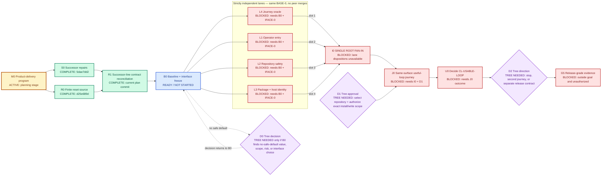

# Usable Product Milestone — Strict Lane Delivery Contract

This is the only active Harness Ultragoal ExecPlan. It implements
`GOAL_CONTRACT.md` and is the delivery state record for `CL-USABLE-LOOP`.

## Purpose and observable outcome

Deliver one exact candidate that an authorized repository operator can
package, install, discover, enter through the Harness front door, fit to a
representative dirty repository, use for affected work, diagnose on a
representative failure, recover or refuse safely, and use again without stale
custody, hidden writes, unrelated-state loss, or a governance loop.

The first value event is a useful verified repository result whose execution,
failure, recovery, preservation, and remaining limits the operator understands.

This reconciliation authorizes planning and contract documentation only. It
does not authorize product code, package mutation, dependency changes, builds,
runtime effects, installation, target-repository writes, remotes,
publication, deployment, credentials, release, or destructive retirement.

## Current status

- Clean successor architecture input: complete at
  `5dae7dd24490b1a37bacb48b40694a840067fbe7`.
- Original finite reset and strict decomposition: complete on the source line
  at `d25e689db61a5d406d457456a2285fb8e68285b1`.
- Prior combined reconciliation: inspected at
  `0aad076b84ae1dbcdd44ece6df04a6a87f6ed95f`; its product bytes and rewritten
  amendment history were not copied.
- Successor-line planning reconciliation: complete in the current plan commit.
- Product-delivery program: active at the planning stage.
- B0 current-behavior baseline and shared-interface freeze: ready, not started.
- L1–L4: blocked on B0 and exact `BASE-0` / `IFACE-0`.
- I0 root fan-in: blocked on required lane dispositions.
- J0 product journey: blocked on I0 and Tree gate D1.
- Release: outside the goal and blocked on a later Tree gate D2.

The dirty project checkout was inspected read-only. Its four modified validator
files and unrelated untracked state are excluded from the base, plan diff, and
future lane authority.

Historical v2 plans, lane/backlog/completion projections, acceptance packets,
receipts, and mandatory-law projections are frozen compatibility inputs. Do
not refresh them.

## Dependency and status graph

Every node includes its status and cause so the graph remains readable without
color. L1–L4 have no edges between them: they consume one frozen root base and
join only at I0.



### Legend

| Color | Status | Meaning |
| --- | --- | --- |
| Green | `COMPLETE` | Accepted input or planning work exists at the named commit |
| Amber | `ACTIVE` | The current bounded program consumes planning attention/budget |
| Blue | `READY / NOT STARTED` | Dependencies are satisfied and work may legally begin |
| Red | `BLOCKED` | Work cannot begin; the node states the exact cause |
| Purple | `TREE NEEDED` | Authority, value, scope, or risk has no agent-safe default |

## Context and architectural reconciliation

Harness Ultragoal has two delivery surfaces:

- the Codex plugin front door, skills, agents, package metadata, installation
  material, and host visibility; and
- the typed Rust CLI for repository fit, routine work, diagnosis, recovery,
  distribution, orchestration, evaluation, migration, and proof.

The clean successor already contains valuable product repairs. B0 begins from
current source rather than old receipts and must respect these owners:

- `repository_fit/` owns confined fit and preservation policies;
- `routine_work/` owns dirty-tree execution and one private custody/recovery
  leaf;
- `distribution/` owns package and runtime identity mechanics;
- `plugin_product/agent_discovery/` owns local discovery observation;
- `plugin_product/lifecycle/` owns plugin lifecycle and host custody;
- `plugin_product/distribution_adapter/` owns package-to-install adaptation;
- `engineering_advisory/` owns proposal-only verification, review, repair, and
  selection projections used by state;
- `plugin_product/skill_catalog/` owns exact Agentic profile/gateway
  validation; and
- `cli/successor/` plus `cli/successor_public/` own public grammar and dispatch.

The other source line proposed additional shared advisory-pack, public-context,
and unfitted-diagnosis product changes. This planning reconciliation preserves
their intent but imports no implementation. B0 must classify them against
`CL-USABLE-LOOP`. If needed, they remain root-owned shared work at I0; if not,
they are not allowed to expand the milestone.

The selected topology is one read-only baseline, zero to four independent
write lanes, one root fan-in, one authorized representative journey, and an
optional later release decision. More lanes would split shared decisions and
increase handoffs; one broad lane would hide four genuinely disjoint domains.

## Authoritative state and lane lifecycle

This plan is the delivery state record. Do not create a parallel lane registry,
verification backlog, completion manifest, review packet graph, or receipt
ledger for this milestone.

Root alone moves a lane through:

```text
defined
→ ready
→ active
→ accepted | no_change | blocked | cancelled
→ merged | waived
```

Workers report facts and request root changes. They cannot change lane state,
shared interfaces, claim meaning, risk acceptance, integration, waiver, or
claim ceiling.

## B0 fan-out contract

B0 is a root-owned, read-only characterization. It does not run the retired
UltraGoal governance loop.

B0 records in this plan:

- `BASE-0`: exact implementation base commit and tree;
- `IFACE-0`: public requests, responses, effect classes, shared types, journey
  steps, advisory bindings, and forbidden substitutions workers consume;
- current plugin/package/public CLI identity;
- each lane disposition: `no_change`, `partial_change`, `change_required`, or
  `blocked`;
- exact owned and root/shared paths after source inspection;
- focused local oracle for each required lane; and
- any D0 choice with no safe default.

All launched lanes start from the same `BASE-0` and consume only `IFACE-0`.
No lane reads or imports peer unmerged work. A changed interface field cancels
only declared consumers.

Candidate B0 commands, subject to current repository truth:

```text
git status --short --branch
git rev-parse HEAD^{commit} HEAD^{tree}
cargo check -p ultragoal --offline
cargo test -p ultragoal --test repository_fit_live_journeys_contract --offline
cargo test -p ultragoal --test routine_public_production_contract --offline
cargo test -p ultragoal --test distribution_contract --offline
cargo test -p ultragoal --test plugin_agent_discovery_contract --offline
```

A missing selector or unavailable tool is a B0 finding, not permission to run
a broad suite or generate replacement receipts.

### B0 advisory/shared-interface questions

B0 must distinguish current architecture from unintegrated proposal:

1. Does the existing `engineering_advisory` plus `skill_catalog` binding make
   the Harness front door usable without a new pack-set type?
2. Is candidate substitution or missing optional advice already typed and
   fail-closed on the public path used by the milestone?
3. Does `HarnessPublicContext-v1` disclose enough candidate identity without
   exposing paths, or is a revalidated redacted executable identity required?
4. When `next` or `diagnose` lacks fitted state, does it causally return the
   safe read-only repository-fit action rather than manufacturing state?

Answers are `no_change`, `change_required`, `outside_milestone`, or `blocked`.
A required shared change stays at I0 and inherits T3 only for the consequential
boundary it actually touches.

## Exclusive ownership map

Read access does not confer write or decision authority. B0 replaces ambiguous
globs with exact paths before launch.

| Lane | Exclusive semantic authority | Exclusive write paths | Forbidden/root-owned surfaces | Local oracle | Tier | Fan-in |
| --- | --- | --- | --- | --- | --- | --- |
| L1 Operator entry | Front-door routing, operator wording, effect disclosure, next-action legibility within `IFACE-0` | `skills/**`, `docs/plugin-resource-map.md`, `docs/install-and-visibility.md` | Plugin manifest, root docs, parser/dispatch, schemas, dependencies, other lanes | Fresh-context route comprehension plus focused skill/reference checks | T1 | slot 2 |
| L2 Repository safety | Fit, dirty-tree routine execution, preservation, interruption, custody, recovery, safe refusal within `IFACE-0` | `validator/src/repository_fit/**`, `validator/src/routine_work/**`, matching `validator/tests/repository_fit_*`, `validator/tests/routine_*` | Public grammar, distribution, plugin lifecycle/discovery, schemas, dependencies, generated authority, other lanes | Focused fit/routine success, failure, preservation, interruption, replay, and recovery tests | T1; T3 only for touched consequential boundaries | slot 3 |
| L3 Package and host identity | Source/package/install/discovery/runtime identity, lifecycle, host custody, effect refusal within `IFACE-0` | `validator/src/distribution/**`, `validator/src/plugin_product/agent_discovery/**`, `validator/src/plugin_product/lifecycle/**`, `validator/src/plugin_product/distribution_adapter/**`, `install/**`, matching tests | Plugin manifest, root inventory, dependencies, shared schemas, public grammar, other lanes | Package/identity checks plus relevant negative effect, rollback, recovery, race tests | T1; T3 only for touched install/host/effect boundaries | slot 4 |
| L4 Journey oracle | Defect-detecting oracle for the frozen journey; no product-value or interface decisions | `fixtures/product-delivery/**`, `validator/tests/product_delivery/**`, `docs/product-specs/usable-product-outcome.md` | Existing implementation, schemas, manifests, dependencies, public grammar, acceptance decisions, other lanes | Red-before-green or equivalent reversal showing detection of missing preservation, diagnosis, recovery, or useful outcome | T1 | slot 1 |
| I0 Root fan-in | Shared public architecture/contracts, advisory binding, dependencies, migrations, effects, integration, claim ceiling | Plugin manifest, root docs, dependency/lock files, schemas, migrations, generated authority, shared CLI parser/dispatch, `validator/src/engineering_advisory/**`, `validator/src/plugin_product/skill_catalog/**`, root-only wiring | Rewriting accepted lane history or absorbing lane-local defects | Ownership/ancestry audit, deterministic fan-in, shared wiring, integrated checks, candidate freeze | T2 plus inherited T3 | single point |
| J0 Product journey | Observation and claim decision only | No source writes; only Tree-authorized install and target effects | Code repair, publication, credentials, deployment, release, scope expansion | Exact installed candidate completes representative journey | T4 | after I0 |

## Lane independence and return contract

A lane is launchable only when it can finish from `BASE-0` and consumed
`IFACE-0` fields, has disjoint write paths and semantic authority, runs its
oracle without peer work, can be omitted without corrupting peers, and exposes
an auditable diff from the base.

Each launch contract binds lane id/owner, base commit/tree, consumed interface
fields, owned/forbidden paths, objective/non-goals, permitted effects, oracle,
proof tier, model/reasoning, budget, two-attempt repair limit, cancellation
lineage, and stop conditions.

The lane returns one message, not a receipt:

- disposition: `accepted_candidate`, `no_change`, or `blocked`;
- lane, branch, worktree, base/head commits and trees;
- exact owned diff;
- consumed interface/dependency identities;
- focused commands, exit codes, and outcomes;
- required failure-path or T3 evidence;
- requested root changes not made;
- residual risk and local ceiling; and
- worktree state plus teardown disposition.

It is ineligible for fan-in if ancestry fails, it has a peer merge, ownership
escapes, semantic decisions overlap, the oracle is untrustworthy, required T3
review is missing, unexplained dirt remains, or proof binds another candidate.

## Proof binding and relevant invalidation

T1/T2 normally use the exact commit, this plan, and concise handoff. Every
accepted proof states candidate commit/tree, surface, maximum claim, consumed
authority/dependencies, oracle/command, relevant environment, invalidation,
and deletion boundary.

| Evidence | Invalidates when | Does not invalidate when |
| --- | --- | --- |
| B0 / `IFACE-0` | Frozen public/shared field, effect class, journey step, or forbidden substitution changes; current behavior contradicts it | Unrelated docs, branch rename, elapsed time |
| L1 T1 | L1 bytes, consumed interface, host/skill contract, or oracle changes | Independent L2/L3/L4 bytes |
| L2 T1/T3 | L2 bytes, consumed fit/routine authority, relevant custody environment, or oracle changes; contradictory observation appears | L1 wording, independent packaging, unrelated docs |
| L3 T1/T3 | L3 bytes, package inputs, install/host authority, supported-host/effect environment, or oracle changes; contradictory observation appears | L1 wording, independent repository behavior, unrelated docs |
| L4 T1 | Oracle bytes, journey acceptance, public observable interface, or anti-substitution rule changes | Implementation bytes the oracle is designed to evaluate |
| I0 T2 | Integrated commit/tree, consumed dependency/toolchain, shared wiring, accepted lane head, or integrated oracle changes | Branch movement preserving commit/tree, age |
| J0 T4 | Installed bytes, host/runtime, target precondition, Tree authority, journey oracle, or contradictory same-surface observation changes | Unconsumed source/docs |
| T5 | Release candidate, distribution/signing/registry, policy, migration/rollback input, or approval changes | Unrelated post-candidate work |

Only declared consumers rerun. Stale evidence loses authority; it does not
trigger broad regeneration or reopen unrelated lanes.

## Single root fan-in

I0 is the only merge and semantic integration point.

Entry conditions:

- `BASE-0` / `IFACE-0` are current;
- each required lane is `accepted`, `no_change`, or `blocked`;
- correctness-critical blockage blocks J0; there is no quorum;
- accepted lanes have clean commit-bound envelopes; and
- root has capacity for fan-in, shared wiring, integrated checks, and one
  correction cycle.

Deterministic order:

1. L4 journey oracle.
2. L1 operator entry.
3. L2 repository safety.
4. L3 package and host identity.
5. Root-only shared/advisory/public wiring, manifests, schemas, dependencies,
   migrations, and generated product projections.

For each accepted lane, root verifies ancestor relationship, absence of peer
merges, and owned diff. A conflict, ownership escape, or interface mismatch
rejects the result; root does not splice a plausible patch.

After merge slots, root audits duplicate semantic work, resolves shared
requests, applies root-only wiring, runs the smallest checks for consumed
surfaces, reruns only inherited T3 evidence whose inputs changed, freezes
`CANDIDATE-0` commit/tree, classifies every lane `merged`, `waived`, or
`blocked`, and closes/cancels worktrees after preserving unique recovery state.

## Tree gates, repair, and stop conditions

| Gate | Trigger | Tree decision | Current status | If absent |
| --- | --- | --- | --- | --- |
| D0 Conditional behavior/interface | B0 finds no-safe-default value, scope, risk, or shared-interface choice | Select behavior or narrow goal | Not currently required | Only affected consumers block |
| D1 Representative use | Before J0 | Choose repository and authorize exact local install/write scope | Needed | No target effect or milestone decision |
| D2 Post-milestone | After J0 | Stop, run materially different journey, or authorize separate release contract | Not due | Stop at bounded milestone |
| D3 External/destructive | Only if separately proposed | Authorize publication, marketplace, credentials, deployment, or destructive retirement | Not authorized by this plan | Effect remains forbidden |

Each lane has two repair attempts. Attempt two names a new causal hypothesis,
changed variable, or stronger oracle. Otherwise return `blocked`.

Stop the affected boundary for ownership escape; interface/semantic conflict;
missing authority; secret/private-data/path risk; ambiguous post-effect or
custody state; untrustworthy oracle; unavailable required T3 review; two failed
attempts without new evidence; budget exhaustion; coordination cost exceeding
saved time; or a product/scope/risk decision without a safe default.

Cancellation propagates only through declared dependencies. Root never resets,
stashes, rebases, or repairs dirty lane work from another worktree.

## Model, cost, validation, and retention

| Work | Default route | Escalation |
| --- | --- | --- |
| B0 deterministic characterization | Terra / medium | Sol for unresolved cross-boundary disposition |
| L1 and L4 ordinary work | Terra / medium | Sol only for a genuinely ambiguous interface/oracle |
| L2 and L3 ordinary work | Terra / medium | One focused Sol falsifier for a current T3 boundary |
| I0 shared decisions and fan-in | Sol / high or xhigh | Ultra only with two ready independent packages and reserved fan-in |
| J0 observation | Sol independent observer | No route substitutes for Tree authority or same-surface evidence |

Track wall time, token cost, duplicated investigation, integration defects, and
cancellation waste. Retain multi-lane delivery only when it beats a strong
single-lane baseline on elapsed time or proof quality without more semantic
defects.

Ordinary output is ephemeral. Persist only the final milestone outcome, an
irreproducible install/host observation needed for it, security/custody/recovery
state needed to resume, or an unreconstructable cross-process handoff. Each
item has finite dependencies, invalidation, retention, deletion, and one owner.

Planning reconciliation validation:

```text
git diff --check
find docs/exec-plans/active -maxdepth 1 -type f
rg -n "classDef (complete|active|ready|blocked|tree)" \
  docs/exec-plans/active/usable-product-milestone.md
scripts/check .
```

The repository-wide check may expose a legacy/generated projection outside the
authorized planning path. Record that exact gap; do not refresh unrelated v2
evidence or product/package templates in this reconciliation.

### Known compatibility blockers

| Blocker | Owner | Cause | Required finite follow-up | Claim impact |
| --- | --- | --- | --- | --- |
| `P-TEMPLATE-PROJECTION` | I0 root | Canonical planning standards changed while `templates/**` is a product/package surface excluded by this reconciliation | At B0, identify whether the milestone's supported install path consumes these templates. If yes, I0 regenerates only the declared projections once and reruns the projector; if no, record them as frozen v2 compatibility inputs | `scripts/project-agent-standards check` and therefore `scripts/check .` cannot support source-completeness, package, or repository-completion claims; the planning-contract claim is unaffected |
| `P-AMENDMENT-VALIDATOR` | I0 root | `validator/src/contract_amendment/validation.rs` accepts only `strengthens`/`clarifies` rows with the old fourteen exact claims, while approved `AMEND-006` is a schema-valid scope reset to `CL-USABLE-LOOP` | If B0 finds a current product reader, I0 updates that one validator/reader contract and focused fixtures to accept the approved append-only scope change; otherwise the legacy reader remains outside the milestone | Runtime amendment validation and any claim consuming it are blocked; Tree's planning authority and the planning-only reconciliation are not promoted into runtime proof |

Neither blocker authorizes package or validator changes today. Each reopens
only if B0 demonstrates that the current milestone consumes its named surface.

## Progress

- [x] Inspect source reset/refinement and clean successor architecture.
- [x] Exclude dirty checkout state and preserve successor product changes.
- [x] Reconcile to one append-only finite goal and one active plan.
- [x] Define color-coded status graph and legend.
- [x] Define four independent exclusive-ownership lanes and one fan-in.
- [x] Define proof tiers, relevant-dependency invalidation, retention, model
  routing, budgets, stop conditions, and Tree gates.
- [ ] B0: characterize current behavior and freeze `BASE-0` / `IFACE-0`.
- [ ] Launch only `partial_change` or `change_required` lanes.
- [ ] I0: merge/waive each required lane once and freeze `CANDIDATE-0`.
- [ ] D1: obtain exact representative-use authority.
- [ ] J0: run the journey and decide `CL-USABLE-LOOP`.

## Surprises, decisions, and outcomes

Surprises:

- The restored worktree was detached at the reset commit while the committed
  successor head lived in a separate dirty checkout.
- `0aad076b` was already a broad merge of reset/refinement and successor
  product work, but copying it would import product bytes and rewrite an
  append-only amendment chain.
- The successor amendment log had advanced through `AMEND-005`, reusing ids
  that the old reset line had rewritten.
- Existing successor architecture already has an `engineering_advisory`
  authority projection; the other line's `plugin_product::engineering_advisory`
  and `AgenticPackSet-v1` are proposals relative to this clean base, not
  current product facts.

Decisions:

- Branch from committed `5dae7dd2`; never merge or absorb dirty checkout state.
- Port only current planning/contract/graph intent, not product/package/runtime
  changes.
- Preserve `AMEND-001`–`AMEND-005` and append one approved `AMEND-006`.
- Keep advisory/public-context/unfitted-diagnosis questions in B0 and root I0;
  they cannot create a fifth overlapping worker lane or expand the milestone.
- Use L4, L1, L2, L3, then root wiring as the only fan-in order.

Outcome and claim ceiling:

This planning reconciliation is accepted when the authorized diff is
planning-only, one active plan remains, amendment and document digests match,
the graph/ownership checks pass, and the worktree is committed cleanly.

It does not establish source correctness, package/install/discovery/runtime
identity, Product Fitness, `CL-USABLE-LOOP`, readiness, release, or completion.
