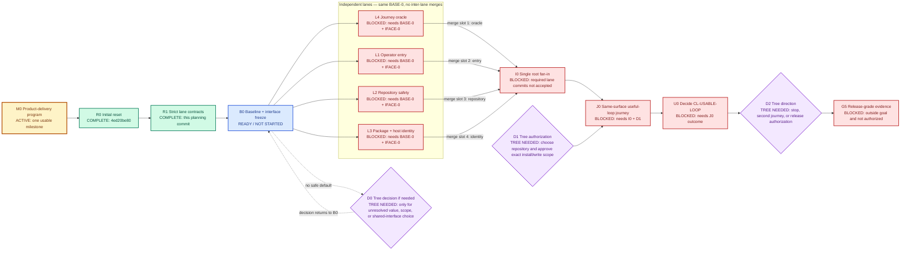

# Usable Product Milestone — Strict Lane Delivery Contract

This is the only active Harness Ultragoal ExecPlan. It implements
`GOAL_CONTRACT.md` and is the authoritative state record for delivery of
`CL-USABLE-LOOP`.

## Purpose and observable outcome

Deliver one exact current-source candidate that an authorized repository
operator can:

1. package and install in an authorized local scope;
2. observe through supported host discovery;
3. enter through the documented plugin front door;
4. fit to a representative repository without changing unrelated state;
5. run useful dirty-tree affected work;
6. diagnose a representative failure;
7. recover or refuse safely; and
8. repeat useful work without stale custody, hidden writes, or a governance
   loop.

The first value event is a useful verified repository result whose execution,
failure, recovery, preservation, and remaining claim limits the operator can
understand.

The original 2026-07-25 plan did not authorize implementation or external
effects. On 2026-07-27 Tree authorized this bounded repair integration,
repository-native verification, private GitHub repository and pull-request
work, local plugin lifecycle reconciliation, and publication before final
Plugin Eval scoring. That authorization does not extend to unrelated target
repositories, credentials disclosure, deployment, destructive retirement, or
release-readiness claims.

## Current status

- Initial product-delivery reset: complete at `4ed20be80`.
- Strict lane-contract decomposition: complete in the commit containing this
  revision.
- Product-delivery program: active.
- B0 current-behavior baseline and shared-interface freeze: active; the
  Agentic advisory addendum is frozen.
- I0 advisory repair fan-in: active under Tree's 2026-07-27 authorization.
  Delivery-reset contracts are reconciled with the descendant live-product
  source retirement; deleted legacy routes and superseded active plans remain
  deleted.
- L1–L4: blocked on B0 and the exact `BASE-0` / `IFACE-0` freeze.
- I0 single root fan-in: blocked on every required lane being accepted,
  classified `no_change`, or explicitly blocked.
- S0 security remediation: active against the sealed exact-revision normal
  scan `a6857d95-8473-4832-ba9a-4cdf74c435fa` at `efdb0ac802b`. Repairs are
  limited to the 29 candidate-bound findings and shared root causes; they do
  not revive deleted legacy modules or raise a product claim.
- J0 same-surface product journey: blocked on I0 and Tree gate D1.
- Release: outside the current milestone and blocked on Tree gate D2.

Historical v2 lane, backlog, completion, acceptance, review, receipt, and
mandatory-law proof projections are frozen compatibility inputs. Do not
refresh them.

## Dependency and status graph

Status is written in every node so the graph remains legible without color.
The four implementation lanes have no edges between them: each consumes only
the frozen baseline and joins only at I0.



### Legend

| Color | Status | Meaning |
| --- | --- | --- |
| Green | `COMPLETE` | Accepted planning work exists in the named commit |
| Amber | `ACTIVE` | Current program is consuming attention and budget |
| Blue | `READY / NOT STARTED` | Dependencies are satisfied; work may legally begin |
| Red | `BLOCKED` | Work cannot begin; the node states the exact cause |
| Purple | `TREE NEEDED` | Value, scope, authority, risk, or external-effect decision has no agent-safe default |

## Context and architectural decision

Harness Ultragoal has two product surfaces:

- the Codex plugin entry, skills, package metadata, and host visibility; and
- the typed Rust command-line interface (CLI) for repository fitting, routine
  work, diagnosis, recovery, distribution, and machine output.

The retained foundation is strict authority, typed boundaries, dirty-tree
preservation, deterministic checks, custody, interruption recovery, and honest
proof ceilings. The rejected operating model is a broad proof graph that
refreshes itself independently of a current product claim.

The smallest sufficient topology is:

1. one read-only baseline and interface freeze;
2. zero to four independent write lanes;
3. one root-owned fan-in;
4. one authorized representative product journey; and
5. an optional later release decision.

A single implementation lane was rejected because the four domains have
disjoint paths and local oracles. More than four lanes was rejected because it
would split shared public decisions, multiply handoffs, or move fan-in work
into workers.

## Authoritative state and lane lifecycle

The active plan is the only delivery state record. Do not create a parallel
lane registry, verification backlog, completion manifest, review packet graph,
or receipt ledger for this milestone.

Root alone moves a lane through:

```text
defined
→ ready
→ active
→ accepted | no_change | blocked | cancelled
→ merged | waived
```

- `accepted` means an owned commit and its required proof tier passed.
- `no_change` means B0 proved the lane's current behavior already satisfies
  the frozen contract.
- `blocked` names the smallest missing authority, capability, interface, or
  oracle.
- `cancelled` means the lane's base or interface became invalid.
- `merged` means I0 consumed the accepted commit.
- `waived` means I0 consumed a current B0 `no_change` decision.

Workers may report facts and request root changes. They cannot alter lane
state, redefine `CL-USABLE-LOOP`, change shared interfaces, approve risk, merge,
waive work, or raise the claim ceiling.

## B0 fan-out contract

B0 is a root-owned, read-only characterization step. It does not run the
retired UltraGoal governance loop.

B0 records directly in this plan:

- `BASE-0`: exact commit and tree from which all lanes branch;
- `IFACE-0`: exact public requests, responses, effect classes, shared types,
  product-journey steps, and forbidden substitutions workers may consume;
- current package and public CLI identity;
- each lane disposition: `no_change`, `partial_change`, `change_required`, or
  `blocked`;
- exact owned and shared paths after current-source inspection;
- focused commands available for each required lane; and
- any conditional D0 decision that lacks a safe default.

All launched lanes start from the same `BASE-0` and consume only `IFACE-0`.
No lane may merge, cherry-pick, copy, or inspect another lane's unmerged work.
If `IFACE-0` changes, root cancels only lanes that consume the changed field,
records the dependency change here, and issues a new base/interface version.

Candidate B0 commands, subject to current repository truth:

```text
git status --short --branch
git rev-parse HEAD^{commit} HEAD^{tree}
cargo check -p ultragoal --offline
cargo test -p ultragoal --test cli_contract --offline
cargo test -p ultragoal --test repository_fit_live_journeys_contract --offline
cargo test -p ultragoal --test routine_recovery_reuse_journey_contract --offline
cargo test -p ultragoal --test distribution_contract --offline
```

A missing selector or unavailable tool is a B0 finding. It is not permission to
run an unrelated broad suite or generate replacement receipts.

### B0 addendum — Agentic advisory integration freeze (2026-07-27)

- `BASE-1/contracts`: `d25e689db61a5d406d457456a2285fb8e68285b1`.
  `BASE-1/source`: descendant live-product head
  `5dae7dd24490b1a37bacb48b40694a840067fbe7`. The reconciliation keeps the
  delivery-reset contracts and active-plan model while consuming the
  live-product line's completed source retirement. It does not restore deleted
  legacy routes, superseded active plans, or unreachable merge `9344d013`.
- `IFACE-0/advisory-pack-set`: `AgenticPackSet-v1` is a caller-supplied,
  candidate-bound value. It has one required `agentic-engineering` base pack,
  optional named companion packs, exact package versions, manifest digests,
  enabled-skill lists, and an aggregate digest. Validation is pure and rejects
  duplicate names or skills, substituted/stale candidate digests, omitted
  enabled skills within a declared pack, and any gateway other than
  `external:harness-ultragoal`.
- `IFACE-0/advisory-selection`: selection returns an exact fully-qualified
  skill plus the aggregate pack-set digest with `proposal_only=true` and
  `claim_effect=none`. An absent optional lens is typed
  `advice_unavailable`; it is never inferred from source, cache, or install
  state. This is not a router, selector store, lifecycle, receipt, effect, or
  claim authority.
- `IFACE-0/public-context`: `ultragoal --json inspect context` moves to
  `HarnessPublicContext-v2`, retaining opaque roots and adding only redacted
  current-process runtime version, executable SHA-256, byte length, and
  `self_bound=true`. The executable path remains internal and capture is
  revalidated before output.
- `IFACE-0/unfitted-read-route`: when `next` or `diagnose` cannot derive the
  existing inventory/ProductState, the existing repository-fit owner is probed
  read-only. A successful probe returns typed `repository_fit_required` with
  `effect=read`, `claim_effect=none`, and exact rerun
  `ultragoal --json fit inspect --target .`; no ProductState or routine
  checkpoint is manufactured.
- This is root-owned I0 shared wiring because it changes public context,
  shared diagnostics, plugin metadata, and a new pure package boundary. It
  consumes no lane-local unmerged work and requires focused T3-style negative
  coverage for candidate substitution, redaction, and zero-write behavior.

## Exclusive ownership map

Read access does not confer decision or write authority. Every write must match
exactly one row.

| Lane | Semantic authority | Exclusive write paths | Forbidden and root-owned surfaces | Local oracle | Proof tier | Fan-in slot |
| --- | --- | --- | --- | --- | --- | --- |
| L1 Operator entry | Skill routing, operator wording, effect disclosure, and next-action legibility within `IFACE-0` | `skills/**`, `docs/plugin-resource-map.md`, `docs/install-and-visibility.md` | `.codex-plugin/**`, root docs, manifests, parser/dispatch, schemas, dependencies, other lane paths | Fresh-context route comprehension plus focused skill/reference checks | T1 | 2 |
| L2 Repository safety | Repository fit, routine execution, dirty-tree preservation, interruption, custody, recovery, and safe refusal within `IFACE-0` | `validator/src/repository_fit/**`, `validator/src/routine_work/**`, `validator/tests/repository_fit_*`, `validator/tests/routine_*` | Public CLI grammar, distribution, agent discovery, shared schemas, dependencies, generated authority, other lane paths | Focused fit/routine contracts, failure paths, preservation, interruption, and recovery checks | T1 by default; T3 only when the change touches authority, custody, concurrency, recovery, migration, or effects | 3 |
| L3 Package and host identity | Source/package/install/discovery/runtime identity and effect refusal within `IFACE-0` | `validator/src/distribution/**`, `validator/src/plugin_product/agent_discovery/**`, `install/**`, `validator/tests/distribution_*`, `validator/tests/plugin_agent_discovery_*`, `validator/tests/plugin_host_lifecycle_*`, `validator/tests/plugin_distribution_adapter_*`, `validator/tests/supported_host_plugin_transaction_*` | Plugin manifest, root package inventory, dependencies, shared schemas, public CLI grammar, other lane paths | Deterministic package/install-test, identity-chain checks, negative effect and rollback/recovery checks | T1 by default; T3 only when the change touches install/host authority, rollback, recovery, security, or effects | 4 |
| L4 Journey oracle | Defect-detecting oracle for the already-frozen journey; no product-value or interface authority | `fixtures/product-delivery/**`, `validator/tests/product_delivery/**`, `docs/product-specs/usable-product-outcome.md` | Existing implementation, shared schemas, manifests, dependencies, public grammar, acceptance criteria, other lane paths | Demonstrated red-before-green or equivalent reversal/mutation showing the oracle catches missing preservation, diagnosis, recovery, or useful outcome | T1 | 1 |
| I0 Root fan-in | Shared architecture, public contracts, dependency decisions, migration, effect authority, integration, and claim ceiling | `.codex-plugin/**`, root docs, `Cargo.toml`, `Cargo.lock`, `package.json`, lockfiles, `plugin-manifest-draft.json`, `schemas/**`, `migration/**`, `generated/**`, shared CLI parser/dispatch, and only the shared wiring not exclusively owned above | Rewriting accepted lane history or silently absorbing lane-local defects | Ownership audit, deterministic merges, shared wiring, integrated checks, candidate freeze | T2 plus every inherited T3 obligation | single point |
| J0 Product journey | Observation and claim decision only | No source writes; only Tree-authorized install and target-repository effects | Any code repair, publication, credentials, release, or scope expansion | Exact installed candidate completes the authorized representative journey | T4 | after I0 |

The glob forms above are ownership contracts, not permission to create broad
catch-all tests. B0 must replace any ambiguous glob with exact current paths
before launching its lane.

## Lane independence test

A lane is launchable only if all answers are yes:

1. Can it finish from `BASE-0` and `IFACE-0` without another lane's commit?
2. Are its write paths disjoint from every other lane and root reservation?
3. Is its semantic decision authority disjoint from every other lane?
4. Can its oracle run without another lane's unmerged work?
5. Can root omit or cancel it without corrupting another lane's branch?
6. Can I0 validate its diff mechanically from `BASE-0`?

If any answer is no, root must combine the coupled work into one lane or keep
the shared change at I0. Worktree isolation is not accepted as a substitute for
semantic independence.

## Commit-bound delegation contract

Each launched lane receives one compact contract:

- lane id and owner;
- `BASE-0` commit and tree;
- exact `IFACE-0` fields consumed;
- owned and forbidden paths;
- objective and non-goals;
- permitted tools and effects;
- selected proof tier and oracle;
- model/reasoning route and wall-time or token budget;
- two-attempt repair budget;
- cancellation lineage and stop conditions; and
- one return envelope.

The lane return envelope is a message, not a durable receipt by default:

- `status`: `accepted_candidate`, `no_change`, or `blocked`;
- lane id, base commit/tree, head commit/tree, and branch;
- `git diff --name-only BASE-0...HEAD`;
- consumed `IFACE-0` fields and relevant dependency identities;
- focused commands, exit codes, and material outcomes;
- failure-path or elevated-boundary evidence when required;
- root-owned changes requested but not made;
- residual risk and local claim ceiling; and
- clean/dirty state plus safe teardown disposition.

A lane result is ineligible for fan-in when:

- its head is not a descendant of `BASE-0`;
- it contains a merge from another lane;
- it writes an unowned or root-owned path;
- it changes a shared semantic decision;
- its oracle is missing or cannot detect the named failure;
- its required T3 review is missing;
- its branch is dirty or its unique uncommitted state is unexplained; or
- its proof is bound to a different commit, dependency, or environment.

## Proof tiers and Verification Mode Contract

Proof escalates only when the lower tier cannot falsify the current failure
mode.

| Tier | Assurance profile | Applies to | Required evidence | Maximum claim |
| --- | --- | --- | --- | --- |
| T0 Context | Micro | Historical docs, plans, supplied output, or unverified observations | Provenance and explicit currentness limit | The context exists |
| T1 Lane commit | Standard | Reversible, isolated owned changes with a strong oracle | Exact base/head commit and tree, owned diff, focused check, failure demonstration when needed, clean handoff | The lane commit satisfies its frozen local contract |
| T2 Integrated candidate | Standard | I0 after all required lane dispositions | Exact integrated commit/tree, deterministic merge audit, shared wiring, integrated checks | The required changes compose as one source candidate |
| T3 Consequential boundary | Elevated | Security, authority, custody, concurrency, recovery, migration, install, host, or external-effect change | T1/T2 evidence plus explicit failure model, relevant negative/fault/rollback/recovery evidence, and one independent focused Sol review | The named boundary is supported on the exact candidate and exercised environment |
| T4 Same-surface product | Critical for authorized effects | J0 | Exact source/package/install/discovery/runtime identity, Tree authority, representative repository journey, preservation, diagnosis, recovery, useful outcome, independent observation | `CL-USABLE-LOOP` only |
| T5 Release | Critical | Only after D2 Tree direction authorizes release work | Fresh release-candidate distribution, install, discovery, runtime, security, migration, rollback, and human approval | The explicitly authorized release claim only |

Coverage volume, receipt existence, reviewer agreement, worker confidence, and
a higher tier on another surface cannot replace a missing lower-tier
authoritative check.

### Commit and dependency binding

Every accepted proof states:

- candidate commit and tree;
- proof surface and maximum claim;
- exact consumed authority and dependency set;
- oracle and command;
- environment identity only when behavior depends on it; and
- invalidation and deletion boundary.

The commit, plan entry, and concise handoff are sufficient for T1 and T2 unless
the observation is irreproducible or required across process custody. Do not
write per-command JSON, copied summaries, periodic refresh records, or
receipts-of-receipts.

### Relevant-dependency invalidation matrix

| Evidence | Invalidates when | Does not invalidate when |
| --- | --- | --- |
| B0 / `IFACE-0` | A frozen public request, response, effect class, shared type, journey step, or forbidden substitution changes; current behavior contradicts it | Unrelated documentation changes, branch rename, elapsed time |
| L1 T1 | L1-owned bytes, consumed `IFACE-0` fields, skill parser/host contract, or its oracle changes | L2/L3/L4 commits that do not change consumed interfaces |
| L2 T1/T3 | L2-owned bytes, consumed fit/routine authority, toolchain/runtime adapter, custody environment when relevant, or its failure oracle changes; contradictory same-surface evidence appears | L1 wording, L3 package work, unrelated docs |
| L3 T1/T3 | L3-owned bytes, package inputs, install/host authority when relevant, supported-host identity, effect environment, or its oracle changes; contradictory same-surface evidence appears | L1 wording, L2 repository work, unrelated docs |
| L4 T1 | L4 oracle bytes, frozen journey acceptance, public observable interface, or anti-substitution rule changes | Implementation changes that the oracle is designed to evaluate |
| I0 T2 | Integrated commit/tree, consumed dependency lock/toolchain, shared wiring, accepted lane commit, or integrated oracle changes | Branch movement preserving the same commit/tree, age alone |
| J0 T4 | Installed candidate bytes, host/runtime identity, target-repository precondition, Tree authority scope, journey oracle, or contradictory same-surface observation changes | Unrelated source/docs not consumed by the installed candidate |
| T5 release | Release candidate, distribution/signing/registry environment, release policy, migration/rollback input, or approval changes | Unrelated post-candidate work |

When one dependency changes, rerun only proofs that declare it. Stale evidence
loses authority; it does not trigger broad regeneration or reopen unrelated
lanes.

## Single root fan-in contract

I0 is the only merge and semantic integration point. No lane merges another
lane, and root does not ask workers to reconcile shared state.

### Entry conditions

- `BASE-0` and `IFACE-0` are current.
- Every required lane is `accepted`, `no_change`, or `blocked`.
- A blocked correctness-critical lane blocks J0; there is no quorum.
- Every accepted lane has a clean commit-bound return envelope.
- Root has reserved time for merge, shared wiring, integrated verification, and
  one correction cycle.

### Deterministic merge order

1. L4 journey oracle, so later integrations are evaluated against the frozen
   product contract.
2. L1 operator entry.
3. L2 repository safety.
4. L3 package and host identity.
5. Root-only shared wiring, manifests, schemas, dependency decisions,
   generated planning projections, and compatibility migration.

If B0 proves a lane `no_change`, its slot is waived in this plan. A merge
conflict, ownership violation, or interface mismatch rejects that lane result;
root does not splice a plausible combined patch. Root may issue one bounded
lane correction against the same `BASE-0` only when `IFACE-0` remains valid.

### Fan-in checks

For each accepted lane:

```text
git merge-base --is-ancestor BASE-0 LANE_HEAD
git rev-list --merges BASE-0..LANE_HEAD
git diff --name-only BASE-0...LANE_HEAD
```

After all merge slots:

1. audit ownership and duplicate semantic work;
2. resolve shared requests against `GOAL_CONTRACT.md` and `IFACE-0`;
3. apply only root-owned wiring;
4. run the smallest integrated checks for consumed surfaces;
5. inherit and rerun T3 evidence only where integration changed its declared
   dependencies;
6. freeze exact integrated commit/tree `CANDIDATE-0`;
7. classify every lane `merged`, `waived`, or `blocked`;
8. cancel or close all lane worktrees and preserve only unique recovery state;
   and
9. proceed to J0 only if no correctness-critical gap remains.

One merged tree or a worker-summary aggregation is not T2 proof.

## Tree decisions and authority gates

| Gate | Trigger | Required Tree decision | Current status | Effect if absent |
| --- | --- | --- | --- | --- |
| D0 Conditional product/interface gate | B0 finds a value, scope, risk, or shared-interface choice with no safe default | Select the product behavior or narrow the goal | Not currently required | Only affected lanes remain blocked; independent legal work may continue |
| D1 Representative-use gate | Before J0 | Select the representative repository and authorize exact local install and repository-write scope | Approved only for local plugin lifecycle reconciliation and clean-home evaluation; no unrelated target-repository write | No broader target write or `CL-USABLE-LOOP` decision |
| D2 Post-milestone direction | After J0 | Stop, run one materially different journey, or authorize a separate release contract | Not yet due | Goal stops after the bounded milestone |
| D3 External/destructive authority | Only if separately proposed | Approve credentials, publication, deployment, marketplace change, or destructive retirement | Approved for private repositories, pull requests, merge, and named plugin publication only | Deployment, credentials disclosure, and destructive retirement remain forbidden |

Agents may not infer these decisions from prior receipts, old plans, memory,
repository state, or worker agreement.

## Repair, cancellation, and stop conditions

Each lane gets two repair attempts. Attempt two must name a different causal
hypothesis, changed variable, or stronger oracle. Otherwise the semantic
circuit breaker opens and the lane returns `blocked`.

Stop the affected boundary for:

- any write outside exclusive ownership;
- a shared-interface or semantic conflict;
- missing Tree authority;
- secret, credential, private-data, or path-confinement risk;
- ambiguous post-effect or custody state;
- an untrustworthy oracle;
- a required T3 boundary that cannot receive focused independent review;
- two failed attempts without new evidence;
- budget exhaustion or coordination cost exceeding expected critical-path
  savings; or
- a product, scope, or risk-acceptance decision with no safe default.

Cancellation propagates only through declared dependencies:

- changing `BASE-0` cancels every unmerged lane;
- changing one `IFACE-0` field cancels only consumers of that field;
- blocking one lane does not stop other independent lanes;
- blocking a required correctness-critical lane blocks I0 completion and J0;
- cancelling J0 has no effect on accepted source lanes; and
- release cancellation has no effect on the bounded milestone.

After interruption, inspect branch, commit, tree, dirty state, worktree, and
unique uncommitted state before resuming. Root never resets, stashes, rebases,
or repairs a dirty lane from outside its worktree.

## Model, reasoning, and cost routing

| Work | Default route | Escalation |
| --- | --- | --- |
| B0 deterministic inventory and focused checks | Terra / medium | Sol only for unresolved cross-boundary disposition |
| L1, L4 ordinary implementation | Terra / medium | Sol only when the oracle or interface is genuinely ambiguous |
| L2, L3 implementation | Terra / medium | Sol focused reviewer for every current T3 boundary |
| I0 shared decisions and fan-in | Sol / high or xhigh | Ultra only when at least two ready lanes remain genuinely independent and root integration capacity is reserved |
| J0 product observation | Sol independent observer | No higher mode substitutes for Tree authority or same-surface evidence |

Use the lowest route that passes a representative oracle. Track wall time,
token cost, duplicate investigation, integration defects, and cancellation
waste. Retain multi-lane delivery only if it beats a strong single-lane
baseline on elapsed time or proof quality without increasing semantic defects.

## Evidence retention and deletion

Keep ordinary command output ephemeral. Persist only:

- the final `CL-USABLE-LOOP` outcome;
- an irreproducible install or host observation needed for that decision;
- security, custody, or recovery state required to resume safely; or
- a cross-process handoff that cannot be reconstructed from commits and tests.

Every retained item declares claim, owner, candidate/environment, relevant
dependencies, invalidation, and deletion. Git history is the archive for
reproducible lane and integration work.

Historical v2 artifacts remain frozen until B0 identifies current readers and
a later root-owned compatibility change proves deletion safe. Their staleness
does not block lanes or cause reproof.

## Progress

- [x] Inspect current contracts, plans, historical receipts, tooling docs,
  foundations, and Agentic Engineering guidance.
- [x] Replace the 14-claim current graph with `CL-USABLE-LOOP`.
- [x] Replace overlapping active plans with this one.
- [x] Define finite G0–G5 gates and proof tiers.
- [x] Define one color-coded dependency/status graph and legend.
- [x] Decompose strict L1–L4 path and semantic ownership.
- [x] Define `BASE-0` / `IFACE-0`, commit-bound handoffs, dependency-specific
  invalidation, deterministic merge slots, Tree gates, repair budgets, and
  cancellation.
- [~] B0: record current behavior and freeze `BASE-0` / `IFACE-0`; the
  Agentic advisory addendum is recorded, while the broader milestone baseline
  remains active.
- [ ] Launch only lanes classified `change_required` or `partial_change`.
- [~] S0: repair and independently falsify the 29 sealed Codex Security
  findings (7 high, 13 medium, 9 low), then run a fresh exact-head closure
  scan. Filesystem, subprocess, evidence-authority, privacy, and runtime
  identity repairs remain candidate-bound and claim-neutral.
- [ ] I0: merge or waive each required lane once and freeze `CANDIDATE-0`.
- [ ] D1: obtain Tree's exact representative-use authority.
- [ ] J0: run the product journey and decide `CL-USABLE-LOOP`.

## Surprises and discoveries

- The initial task worktree was detached; the reset created
  `codex/ultragoal-product-delivery-reset` before editing.
- Historical control state named 18 blocked lanes and 14 withheld claims while
  the closest product milestone was already the installed useful loop.
- Recent source history removed disconnected legacy graphs while active plans
  and projections still described them.
- Legacy mandatory-law policy and audit projections still bind broad receipt
  surfaces and deleted plan names. They are migration inputs, not authority to
  restore the plans.
- Current schemas and validator source enumerate some deleted plan names. B0
  must classify those live readers; I0 owns any later code/schema migration.
- The first reset's four lanes were path-disjoint but did not yet prohibit
  lane-to-lane commit consumption or define exact proof dependency
  invalidation. This revision closes that planning gap.
- After this decomposition, `scripts/check .` still exits 1 at
  `generated surface authority stale` immediately after confirming the agent
  standards projection is current. The stale v2 projection is a named
  compatibility blocker; this planning pass does not refresh it or treat that
  refresh as product progress.
- The sealed S0 scan covered all 5,047 committed files with zero unresolved
  rows. It found repeated path-only check/use gaps, direct ambient Git and
  repository-Python execution, self-attested proof boundaries, durable private
  host metadata, and a public runtime projection that measured the
  `current_exe` path occupant rather than the running image.
- The exact built CLI reproduced two boundary failures: a nominally read-only
  strict check executed repository-owned Python and wrote outside its target,
  and a suspended process whose executable path was replaced reported the
  replacement bytes with `self_bound=true`.
- S0 repairs now route Git through the captured capability with bounded
  process-group custody, remove repository-Python execution from strict
  validation, bind affected filesystem sinks to opened objects, reject
  self-attested proof, redact current-tree private metadata, and lower
  path-only runtime identity to `self_bound=false`.
- The warning-denied library build, changed-behavior tests, generated-authority
  check, and all 121 standards-enforcement rows pass. `scripts/check .` reaches
  only its declared exit-4 narrow-helper ceiling. The broad parallel library
  suite remains an invalid aggregate oracle: two unchanged-base runs produced
  different failure counts because shared fixtures and global test hooks
  interfere. Candidate deltas are therefore rerun individually.

## Decision log

- **2026-07-25 — one milestone:** only `CL-USABLE-LOOP` advances.
- **2026-07-25 — one active plan:** Git history replaces backup plans.
- **2026-07-25 — smallest topology:** B0, up to four independent lanes, I0,
  J0, then an optional later release decision.
- **2026-07-25 — no inter-lane dependencies:** every lane consumes only
  `BASE-0` and `IFACE-0`; shared changes stay at I0.
- **2026-07-25 — deterministic fan-in:** L4, L1, L2, L3, then root wiring.
- **2026-07-25 — proof economy:** T1/T2 are commit-bound and ephemeral by
  default; T3–T5 add evidence only for the current boundary.
- **2026-07-25 — relevant invalidation only:** a proof reruns only when a
  declared consumed dependency changes or same-surface evidence contradicts
  it.
- **2026-07-27 — explicit advisory packs:** consume only candidate-bound
  `AgenticPackSet-v1` through the existing Harness front door. No Agentic
  router, cached-package inference, state store, receipt, effect, or claim
  authority is introduced.
- **2026-07-27 — source reconciliation:** preserve the newest delivery-reset
  contracts while bringing forward the live-product line's completed source
  retirement. This is an explicit combined descendant, not a restoration of
  the deleted legacy architecture.
- **2026-07-27 — bounded delivery authority:** Tree authorized private remote,
  pull-request, merge, local publication, and post-publication evaluation work
  for this repair. Claims remain limited to evidence from each exact surface.
- **2026-07-27 — security repair boundary:** consume only the 29 findings from
  sealed scan `a6857d95-8473-4832-ba9a-4cdf74c435fa`; prefer shared typed
  owners for repeated root causes, require independent focused falsification,
  and prove closure with a new exact-head normal scan before publication.
- **2026-07-27 — privacy overrides byte preservation:** frozen compatibility
  records that contain an operator username, home/worktree path, or private
  task/session identity are redacted in the current tree. Only their exact
  non-authoritative compatibility digests may be recomputed; their historical
  semantics and authority ceiling remain frozen. Git history cannot be
  redacted by this local repair and therefore remains private.
- **2026-07-27 — honest runtime identity:** `self_bound=true` requires a
  platform-backed binding to the running image. Path-only hashing may report
  an unbound identity or fail closed, but must not preserve the stronger claim
  for interface compatibility.

## Outcomes and claim ceiling

This planning pass is complete when the active plan, `GOAL_CONTRACT.md`,
`PLANS.md`, and append-only amendment agree; the graph and ownership checks
pass; and the planning-only commit is clean.

Product delivery remains unstarted until B0. This plan does not establish
source correctness, package identity, installation, host discovery, runtime
behavior, product fitness, `CL-USABLE-LOOP`, readiness, release, or completion.
