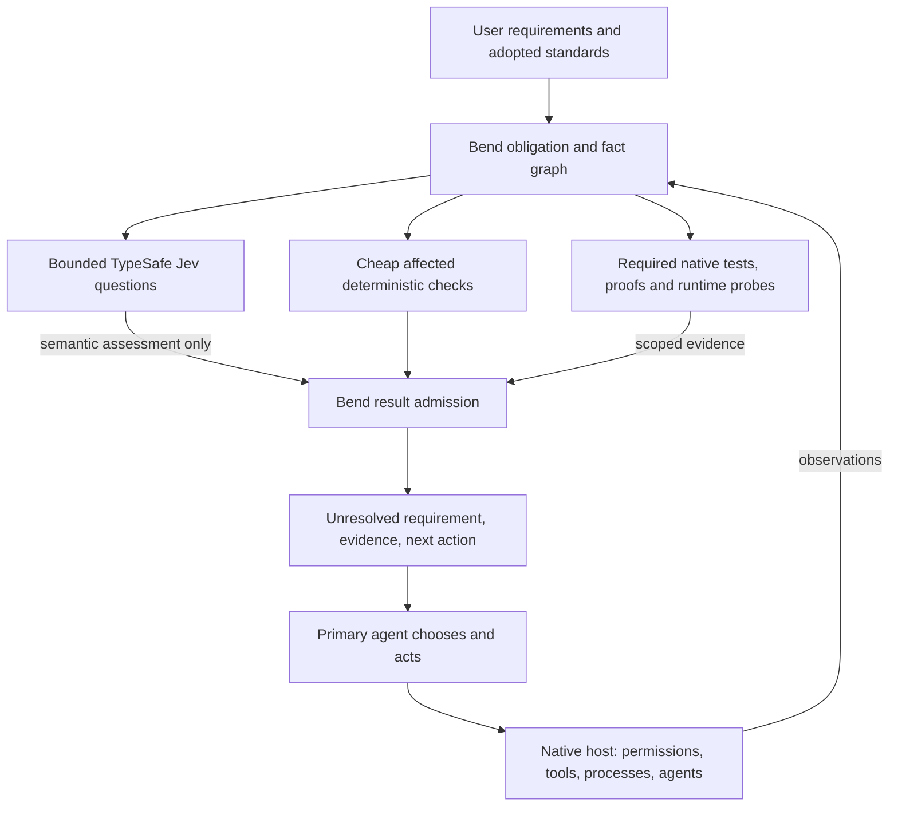

# UltraGoal Next: architecture and design

Status: design approved for full implementation; acceptance pending. Evidence cutoff: September 21, 2026, America/Los_Angeles, with subsequent implementation observations labeled separately. The root [current architecture](../../../ARCHITECTURE.md) remains the owner of legacy behavior until verified successor integration.

Companions: [PRD](PRD.md), [audit and research](AUDIT.md), [migration](MIGRATION.md), [evaluation and roadmap](EVALUATION.md).

## 1. Decision and ownership

Build one UltraGoal product around a Bend core for obligations, parsing, normalization, facts, dependency graphs, evaluation, evidence admission, and useful next actions. Integrate Jev inside that evaluator. Keep the primary agent responsible for invention, planning, implementation, interpretation, and deciding which optional investigation is worth doing.

UltraGoal owns whether its report supports a specified requirement at a specified assurance level. The native host owns actual permissions, sandboxing, tool execution, agent scheduling, interruption, and user interaction. A CI/release owner can consume the report at an independently protected boundary. UltraGoal does not claim it can prevent every action a host permits.

The diagram shows logical requests, not independent policy engines. Rust adapters move bounded bytes and execute already admitted transport operations; Bend owns UG policy. Native host permission denial always wins. A model response can never enlarge scope or grant execution.

| Decision/state | Sole owner | Boundary |
| --- | --- | --- |
| Meaning of requested outcome; creative approach | User and primary agent | Proposed interpretations are not adopted requirements |
| Adopted contract revision | User-authorized adoption through a protected host/CI channel | Repository edits cannot self-approve a revision |
| Applicability, coverage, evidence admission, UG consequences | Bend core | Adapters and Jev cannot override |
| Computation cache and logical evaluation state | Bend core | Rust supplies atomic storage primitives only |
| OS permissions, sandbox, processes, task/agent lifecycle | Native host | UG observes IDs/status; does not clone the scheduler |
| Jev inference | TypeSafe service | No authority, proof, or guaranteed availability |
| Provider connection, TLS, cancellation at transport | Narrow Rust adapter under host policy | No semantic threshold or task policy |
| Native compiler/test/runtime truth | Named verifier and actual observed surface | Imported evidence retains its scope and limitations |

## 2. One representation

Use immutable values and typed state transitions. These are conceptual types to implement and prove, not claims of existing Bend code.

| Value | Required fields |
| --- | --- |
| Requirement | stable ID; exact statement; origin/excerpt; revision; adopted-by/provenance; non-weakenable acceptance dimensions |
| Obligation | requirement ID/revision; applicability rule and basis; scope selector; required assurance; input/dependency queries; rule/evaluator version; consequence; acceptable evidence kinds; expiry/live prerequisites |
| Fact | kind/schema; normalized value; input content and path provenance; parser/extractor/tool version; configuration/target; supported construct set; dependency completeness |
| Check | implementation digest; inputs and dependency queries; supported coverage; budgets; output type; deterministic or semantic or external |
| Evidence | exact subject; producer/tool identity; input/dependency digest; rule/rubric/model identity where relevant; result; observed surface; time interval; completeness; trust assumptions |
| Concern | unresolved obligation; exact evidence/excerpts; severity under adopted policy; stable fingerprint; smallest useful action; changed/acknowledged state |
| Operation | unique ID; contract revision; current input generations; live host context; admission policy; deadline/budget; cancelled/superseded state |

An obligation is never just a checklist label. Example: “Cancellation leaves existing user output unchanged” originates in the accepted request; applies to the writer and all its callers; requires a cancellation runtime test; depends on writer, caller, output configuration, selected fixture, and cancellation adapter; cannot be discharged by a syntactic check or Jev’s favorable assessment.

Dependencies include positive reads and negative queries: “all files matching selector S,” directory membership, absence of a file, import resolution configuration, lockfiles, environment allowlist, tool identity, generated inputs, and dynamic/unknown edges. Membership nodes fingerprint the sorted path/type set, separately from file content. Each query fingerprints only its consumed projection: a names-only query does not depend on all matching contents, while a query counting definitions depends on extracted definition facts. Additions, deletions, renames, ignore changes, case collisions, and configuration changes can therefore invalidate an answer even if its previously read files did not change. An unrelated content edit preserves a membership-only result.

Keep path identity and content identity separate. Renamed content can reuse a path-independent syntax tree, while path-sensitive ownership/import rules rerun. Changed bytes invalidate syntax/facts; changed rules invalidate their derived results without forcing unrelated parsing.

Unknown dependencies have a typed reason and conservative affected scope. Expand to a package/workspace or full scan when defensible; otherwise report incomplete coverage. A watcher is a hint, never sole evidence that nothing changed. Lost events, changed ignore policy, or untrusted snapshot cursors force a membership refresh.

## 3. Reuse versus admission

The computation key is a canonical digest of the implementation/rule version, relevant normalized inputs, dependency-query results, configuration, parser/tool identity, and declared assumptions. Semantic keys additionally bind model version, rubric, option order, evidence packet, language, and disclosure policy. Never include an unrelated whole-product candidate or plan ID merely because it exists.

Admission is a separate predicate evaluated for the current operation: subject and requirements still match; dependencies are complete or explicitly bounded; evidence assurance satisfies the obligation; producer and rule are accepted; authorization and scope remain valid; result is not late, cancelled, superseded, expired, or conflicting. Cached computation can remain useful while being inadmissible for a release operation.

Incremental evaluation:

1. Obtain a bounded snapshot manifest and compare membership/configuration/tool fingerprints.
2. Reuse content-addressed parses, then facts whose actual dependencies are unchanged.
3. Invalidate reverse dependency closures, including query/membership nodes.
4. Evaluate independent ready nodes in balanced work batches; sort combination by stable keys.
5. Compute the current applicable obligation set from the current contract and scope.
6. Admit matching evidence independently for each obligation; keep every remaining obligation unresolved.

If a changed applicability rule introduces an obligation, absence of an old result is unknown, never success. Removing an obligation requires an authorized contract revision or an explicit current non-applicability basis.

The equivalence theorem is conditional: for a pure evaluator, complete tracked dependencies, canonical inputs, fixed rule/tool identities, and valid snapshots, incremental results equal full recomputation. It does not prove filesystem observation completeness, compiler correctness, or external test determinism. Differential tests exercise those adapters separately.

## 4. Bend-native parsing and analysis

Start with parsers for UG’s own small versioned contract and wire formats, then shared text/Markdown and selected source facts. Bend owns tokenization, syntax handling, normalization, fact extraction and analysis where the supported grammar can meet correctness and performance requirements. The absence of a current JSON/parser library is work to bound and measure, not a permanent Rust reservation.

Parser contracts:

- Bounded bytes, tokens, depth, work/fuel and output size; explicit errors with safe byte offsets.
- Total result: success with consumed range, malformed, unsupported construct/version, resource limit, or unavailable; never an empty successful AST after an error.
- Progress or termination for every loop; full-consumption check where the format requires it.
- Stable spans into original bytes; explicit UTF-8/newline normalization map; no silent lossy replacement.
- Canonical encode/decode laws for the supported subset; duplicate keys rejected for authority-bearing formats.
- Parse once per content/grammar/configuration identity; share immutable parsed and fact representations across rules.
- Balanced independent file/chunk work after measuring the split and merge costs; no claim that GPU execution helps ordinary repositories.

Proposed initial coverage:

| Surface | Bend responsibility | Native boundary and limitation |
| --- | --- | --- |
| UG contract/wire format | Complete small, versioned bounded grammar | No host-defined extension silently accepted |
| JSON | Complete selected standard grammar with duplicate-key policy | Limits explicit; numbers preserve lexical/precision semantics |
| Markdown/text/doc sources | Headings, links, sections, code fences, exact excerpts | Rendering, accessibility and document fidelity need actual renderers |
| Rust | Bend lexical/structural facts; grow grammar under differential corpus | Retain a syntax compatibility adapter only while full Rust grammar is unqualified; rustc owns type/macro/build semantics |
| TypeScript/JavaScript | Bend structural/import facts where qualified | Compiler API/tsc owns project/module/type semantics; dynamic imports stay uncertain |
| Python | Bend structural/import facts where qualified | Python AST/compiler and tests remain native verification; reflection cannot be inferred away |
| TOML/YAML and rich documents | Prefer Bend bounded supported parsing; explicit unsupported states | Temporary mature format/parser tools when actual compatibility demands them; no blanket “all parsing in Rust” |

Do not use lexical absence as proof that a language feature does not exist. Macros, generated code, conditional compilation, reflection, dynamic imports, runtime configuration and platform targets introduce dependencies or coverage limits. A parser is not a language server or native compiler replacement.

The performance investigation must separately instrument discovery, reads/decoding, tokenization, parsing, fact extraction, dependency computation, rule work, serialization, process/build startup, native tests, and model/network time. Shared facts and narrower invalidation are the leading design improvements; Bend speedup is a hypothesis. See [measurement plan](EVALUATION.md).

## 5. Rust exceptions: justified, narrow and revisitable

The retained unit is a capability, not an old Rust subsystem. Current source modules are donor material only after tests establish the smaller interface.

| Exception | Exact responsibility and why presently necessary | Smallest interface; trust/failure boundary | Crossing cost; lifespan and exit evidence |
| --- | --- | --- | --- |
| R1 OS observation/storage | Descriptor-bound reads, no-follow/path containment, file identity, bounded directory enumeration, atomic cache publication and locks; physical bounded stream framing. Bend’s exposed filesystem API does not establish the required OS semantics. | observe(rootHandle, selectors, limits) → bounded manifest/bytes/errors; comparePublish(expectedGeneration, bytes); physical frame read/write with early allocation cap. No rule decisions, approvals or arbitrary shell. OS observation and foreign code remain trusted. | One coarse manifest/changed-byte batch per operation; measure copied bytes/syscalls and startup. Expected to remain until Bend exposes and tests equivalent primitives. |
| R2 secure transport | Direct TypeSafe HTTPS, certificate verification, credential injection from authorized host secret storage, cancellable requests and bounded response reads. Current Bend lacks qualified TLS/HTTP support. | send(endpointID, bodyBytes, deadline, quotaReservation) → status/bytes/timing. Fixed endpoint; no provider-choice policy; one request cannot enlarge disclosure. | One local crossing per independent evidence batch; TLS/network measured separately. Expected to remain until supported secure Bend transport is qualified. No OpenRouter. |
| R3 compiler/grammar compatibility | Preserve exact Rust syntax acceptance using a narrow mature parser where Bend coverage is not yet proven; normalize compiler/test output from native tools. No type/macro claims from syn. Other languages normally use their native tools rather than Rust reimplementations. | parseRust(bytes, edition, limits) → versioned syntax facts/diagnostics; importObservation(NativeObservation) → typed record using the bound execution envelope below. Bend decides use/admission. | One parse per content identity; no per-rule or parent/child reparsing. Temporary syntax adapter; retire language-by-language after corpus equivalence, malformed-input and latency gates. Native compiler integrations may remain. |

Hashing is Bend-owned by default, including canonical bytes, algorithm identity and comparisons. Bend has integer/bit primitives; no demonstrated language limitation justifies a separate Rust hashing subsystem. Qualify against published vectors and independent implementations. An existing host hash primitive may be used temporarily only after a measured interoperability/performance need, with exact scope and retirement evidence recorded.

No retained Rust scheduler, rule engine, authorization interpreter, rubric threshold table, obligation store owner, generic supervisor, or independent graph planner. Rust validates transport envelopes and hard buffer bounds for memory safety; Bend validates semantic schemas, adopted budgets and consequences. Redundant implementation of semantic policy is forbidden.

Initial process design: one compiled Bend core and one unprivileged Rust bridge per active invocation, coarse length-bounded frames with protocol/version/operation IDs. No per-rule subprocesses, default daemon, database service, or mandatory FFI. A measured FFI/embedded variant is permissible later if serialization dominates and its larger shared crash/trust boundary earns its keep. Compile at build/package time, never after each user edit. The target toolchain/runtime and C-output deployment route remain qualification gates.

### Explicit retained computation sessions — September 23 implementation decision

Standalone commands retain the one-shot design above. Add an opt-in foreground
session for warm reuse across separate fresh CLI processes: one explicitly owned
workspace session retains one compiled Bend core and its typed parse/fact/query
values. Fresh clients connect only through an explicitly supplied local endpoint.
No automatic startup, silent detachment, boot registration or global service.
This extends the core lifetime; it does not introduce a second decision owner.

Use a bounded Unix-domain transport in a newly created owner-only directory,
restricted socket permissions and supported peer checks. A trusted inherited
descriptor would be preferable where an actual host integration supplies it;
none has been established on the inspected host. A socket path, PID, nonce or
same-user token is not protected host attestation. Exact computation laws apply
under the stated trusted-running-code/input assumptions; a client-visible
response does not acquire authenticated provenance merely by using this socket.
Protected adoption and strong native-observation obligations remain unresolved
without their separately qualified channel.

Rust handles physical connection framing, bounded queues and process lifecycle.
Bend owns retained state, dependency comparisons, reverse-closure invalidation,
applicability and admission. The session provides computation only: it cannot
launch arbitrary commands, execute verifiers, call providers, adopt requirements
or grant permissions. Those effects remain with the requesting native host or
existing authorized frontend. Begin with serialized requests to keep operation
state isolated; logical policy must not move into the transport owner.

Bind each session incarnation to the workspace and fixed engine/toolchain
identity. Each request independently binds its operation, original requirements,
scope, current observations, configuration and applicable rules. Revalidate
membership, negative queries and consumed inputs; retain useful parses without
retaining a prior final admission decision. Unknown dependencies or uncertain
change observation require conservative evaluation or explicit unknown coverage.
Rule/configuration changes invalidate the relevant computation; workspace/core
identity mismatch requires a new session. Client-supplied flags cannot create
trusted parse objects or protected adoption.

Specify idle/absolute lifetime, memory, request-count and per-operation bounds.
Cancel, disconnect, malformed input, deadline or crash must prevent late admission
and partial-state publication. Reset the core when safe interruption cannot be
isolated. Owner close removes its owned endpoint and drops in-memory witnesses;
restart has a new incarnation and cold computation. Do not deserialize editable
disk results as proof witnesses or silently reconnect to an arbitrary endpoint.
Explicit session connection failure returns a clear unavailable result; the
caller can deliberately run the ordinary cold command.

Qualification must show fresh frontend PIDs using retained Bend values, useful
unchanged reuse and affected recomputation equal to a cold run, plus endpoint
replacement, cross-workspace, stale/duplicate response, cancellation, concurrent
client and shutdown tests. This design decision authorizes local implementation;
it is not evidence of runtime, latency or protected-host qualification. Persisted
facts remain an alternative only if their validation and operating cost justify
them without recreating an untrusted-result admission path.

### Native execution and observation contract

An imported output string is not an execution observation. Before a required verifier runs, Bend creates a VerificationRequest binding operation/request ID, obligation IDs, verifier identity/version/digest, argv, working directory identity, configuration and permitted environment fingerprints, declared dependency/scope selectors, immutable input snapshot ID, expected outputs, deadline and required surface. The authorized native host owns execution, permission review and cancellation.

NativeObservation binds that request to the host-issued execution ID and producer provenance, actual executable/arguments/environment, input-binding method and digest, start/end observation, terminal status (exit code, signal, cancelled, unavailable or ambiguous), bounded stdout/stderr with truncation and full-stream digest when available, artifact digests, and final observed input state. The bridge must receive it through the qualified host integration; arbitrary agent-authored JSON or text is reported evidence, not authenticated execution.

Preferred input binding is a read-only immutable source snapshot with writable build/test outputs confined separately. For verifiers that require a live working tree, the adapter must establish a qualified observation protocol for the actual read set and concurrent mutation. Simple before/after hashing cannot rule out an intervening edit and restoration; it provides a weaker observation, not exact immutable-input verification. If required assurance cannot be established, mark that obligation unknown or request a snapshot-compatible run. Generated inputs, native dependency discovery, environment and external services retain explicit completeness assumptions.

Admission uses the request's captured input identities, never current digests attached after the fact. Compare the observed terminal status and artifact identity with the expected verifier contract, reject replay/mutation/partial-output cases, and separately determine whether the checked inputs are admissible now. This protocol is a proposed adapter contract; current host availability is a P3 qualification question, not an invented native capability.

## 6. Jev as an internal evaluator

Use direct TypeSafe access through R2. The evaluator calls Jev when an adopted relevant semantic rule becomes dirty, not when the agent happens to remember an MCP tool. No new supervisor model is introduced.

Pipeline: deterministic eligibility → relevant facts and exact excerpts → disclosure filter → fixed versioned rubric/question set → quota/deadline reservation → bounded shared-state request → strict response validation → per-rule calibration/abstention → current-operation admission → changed concern or assessed-clear result.

Internal request fields: operation and request IDs; rubric/version; exact model; typed question kind; ordered option/scale IDs; bounded state/excerpts with provenance; input digest; maximum cost; total deadline; disclosure policy. The current vendor wire body is state/model/questions, and its response is model/answers/usage; the transport correlates the response with the immutable internal request. Do not assume the service echoes our operation IDs or input digests. Question IDs are correlation labels, not inference instructions: each question explicitly names the relevant state fields. Response fields preserve raw typed probabilities/distribution and provider metadata, plus validation and abstention reason. Text generated by an agent is untrusted source material, not a new rubric.

| Proposed rubric | Prepared facts and question | Best Jev form | Consequence |
| --- | --- | --- | --- |
| Outcome alignment | Requirement clauses vs delivered behavior and evidence | Choice: supported / contradicted / insufficient | Targeted concern; cannot certify acceptance alone |
| Verification adequacy | Changed assertions, test setup and actual execution surface | Choice plus bounded Noul for specified weakening proposition | Require named investigation under adopted policy |
| Masked/placeholder behavior | Error branches, stubs, caller expectations, failing observations | Noul per exact proposition; explicit insufficient-context Choice where needed | Locate suspicious path; native regression check decides behavior |
| Cross-surface inconsistency | Caller, implementation, test and doc excerpts sharing a symbol/contract | Choice: consistent / mismatch / insufficient | Inspect exact conflict |
| Failure-path completeness | Cancellation/retry/partial-result state edges and missing coverage | Choice over specified missing behavior | Request discriminating test or analysis |
| Ownership/abstraction | Fact graph of state/decision owners and consumers | Choice over concrete duplicate-owner or leak hypotheses | Advisory redesign investigation, never forced architecture rewrite |
| Contradicted premise/repeated recovery | Prior hypothesis, attempted mechanism, observed contradiction and unchanged inputs | Choice: new evidence / same mechanism / insufficient | Propose a different experiment after a configured bounded repeat |
| Investigation reuse/retrieval | Deterministic eligible candidates with provenance and current deltas | Score usefulness or Choice among candidates | Rank optional work; never remove mandatory coverage |

### Query-aware evidence selection and investigation reuse

This is a first-class internal capability, not merely an optional “review this repo” question. The user-supplied creator note motivates making the existing retrieval/reuse requirement concrete:

1. Bend and native observation perform filesystem discovery, cheap indexing, supported parsing/facts, exact dependency filtering and lexical/structural candidate retrieval. Repair algorithmic scanning costs here; Jev cannot remove the cost of obtaining bytes it must inspect.
2. For a specific unresolved question, prepare a bounded candidate set of exact source spans, summaries already available from a trusted derivation, and relevant prior findings. On large repositories, use an indexed hierarchy to broaden candidate generation before fine ranking. Record candidate recall/unknown coverage separately from selection quality.
3. Ask independent Jev relevance/support questions over shared relevant state, or use bounded Choice with a no-match route. Per-candidate Noul supports an absolute relevance proposition; unrelated Choice-batch probabilities are not directly comparable. Code selects optional supplemental context within budget while retaining required requirements, known failures, contradictions and mandatory dependency evidence.
4. Produce an inspectable evidence bundle containing original spans, IDs, input/rule/model identities, selection basis, omissions and remaining gaps. Jev selects among supplied representations; it does not generate summaries. A primary agent may author a summary, whose source identity and limitations remain visible.
5. Before another optional investigation, match its question and current dependency delta against recorded findings. Offer existing current evidence, a specific missing-evidence investigation, or no suitable match. Semantic similarity cannot certify stale findings or eliminate mandatory verification.
6. Reuse prepared evidence across related semantic rules and review requests. Expose pending work/cancellation through the existing operation; do not introduce hidden background workers, a replacement agent loop or host transcript collection.

Compare the complete local-search → Jev → selected-reading → recovery path with efficient local search and the same path without Jev. Include main-agent context/cache costs where observable. The expected benefit is avoided reading, duplicate investigations and retries; more model calls is not success. Host KV-cache management, native compaction, private reasoning and primary-model scheduling stay with the host. Optional resource selection never filters out binding user/AGENTS obligations.

Prefer these consequential interventions to simple classifications that code can settle. Optional ranking has value only when it avoids measured expensive work. Independent questions can share relevant state; unrelated packages/issues stay separate. Start with a proposed 12k-token evidence target, an 8-question batch cap and a 20k-token hard packet ceiling; these are tunable product limits below vendor limits, not optimality claims. Oversized state is split by obligation or marked incomplete, never silently truncated.

Questions in a batch cannot read one another's answers. A question about a selected candidate must either name each candidate in advance or run after selection with the actual result in new state. Retain the exact decision-time candidate set and measure retrieval/state-builder recall separately; a chooser cannot recover omitted evidence. Contradiction requires an explicit conflict: a passage stating a feature is available on Pro does not establish or contradict universal availability. Preserve insufficient support as its own semantic outcome.

Preserve Choice selected-option probability separately from its distribution-derived confidence. Treat Noul probability as its proposition output, not a Choice confidence. Preserve Score distributions and scale values rather than pretending the expected score is certainty. Calibrate each rule/model/version against positives, negatives, exceptions and abstentions; no universal 0.8 threshold.

Response validation rejects missing/extra/duplicate question IDs, wrong kind/model/schema, unrequested options, nonfinite or out-of-range values, invalid distribution mass within specified numeric tolerance, truncated payloads, and mismatched request/input identities. Missing fields never default to clear. Numeric validation happens in code.

Validate Score's legend/order and probability-weighted level against its reported score with explicit rounding tolerance. Conflicting otherwise-valid semantic answers remain a review signal; do not coerce consistency or multiply correlated question probabilities into invented certainty. A rubric may need only one question type: using Choice, Score and Noul together is not itself additional assurance.

One operation has a total deadline spanning queueing, retries and network work. Proposed semantic budget: two concurrent batches, at most one transient retry with jitter only within remaining quota/deadline; no retry on schema failure or policy denial. Reserve worst-case request cost before sending; deduplicate identical inflight keys; cancel obsolete work where transport supports it. A timeout cannot guarantee the provider stopped billing; account for ambiguous requests conservatively. Cache only validated results, bind full model/rubric/input identities, and do not treat mutable model aliases as stable cache versions.

Semantic policy can require resolution of a concern before a report becomes admissible. Resolution is a targeted investigation, corrected implementation, or reasoned exception authorized at the contract’s specified boundary. “Assessed clear” is distinct from exact verification. Jev never supplies evidence of permission, freshness, identity, arithmetic correctness, formal proof or observed runtime behavior.

Data disclosure defaults to disabled until an authorized policy permits specific source classes and provider use. Exclude credentials, personal transcripts, irrelevant paths/content and hidden state; minimize code to relevant spans. Vendor public policy states no training/fine-tuning on inputs; the DPA describes purpose-based retention and enterprise ZDR is not the default. Applicable account retention, residency and contractual guarantees remain Unknown until verified. No private upload or live model campaign occurred in this planning work. Provider schemas do not supply a general abstention state: encode insufficient-evidence choices where suitable, and abstain deterministically for incomplete packets or unqualified rules.

## 7. Proof architecture

Opportunity A proves UG’s modeled pure logic. Opportunity B imports project proofs where the project implementation and toolchain support them. The second is optional; unsupported languages must still use native tests, static checks and runtime observations.

Proposed LAWS.bend laws and corresponding PROOF.bend obligations:

| Law | Statement and assumptions |
| --- | --- |
| Evidence identity/freshness | Admission cannot discharge with mismatched subject, inputs, rule or freshness under the modeled identity/time predicates |
| Unknown preservation | Unknown, unavailable, malformed and incomplete cannot construct verified or assessed-clear |
| Mandatory coverage | Every applicable mandatory obligation is discharged by admissible evidence or remains explicitly unresolved |
| Authority separation | Semantic response types cannot construct authorization or formal proof evidence |
| Incremental equivalence | Reuse equals recomputation under complete dependencies, pure rules, canonical snapshots and fixed tool identities |
| Deterministic combination | Independent results combine identically under permutation; conflicts remain conflicts |
| Lifecycle safety | Cancellation, supersession, duplicate and late-result transitions cannot revive an obsolete operation |
| Bounded work | Scheduling consumes reserved nonnegative budgets and preserves resource limits; real clocks/OS cancellation remain adapter assumptions |
| Requirement preservation | Ordinary work cannot lower required assurance, remove mandatory scope or alter adoption without a valid contract revision |

Proof/source/rule identity is an ordinary dependency record, not a new receipt hierarchy. Record compiler source and executable hashes, flags, generated artifact identity, transitive imports, unsafe/foreign use, and theorem names. List assumptions explicitly. Never infer “formally verified engine” from a passing example or a README.

The installed compiler is now Bend 2.0.25, matching the latest official release checked after the user’s update. It includes soundness repairs absent from former 2.0.5. Fresh local smoke probes confirmed valid/invalid proof handling, check-only execution suppression, LAWS-import refusal and transitive unsafe reporting. Current upstream still documents incomplete compiler assurance and unsafe/foreign boundaries. Promotion requires the named law suite on the current release, every theorem completed, no holes/admissions/unsafe proof dependencies, and transitive diagnostic inspection—not merely process exit zero. Use the non-executing checker path and verify PROOF imports the adopted LAWS. Foreign execution semantics and normalized-input fidelity remain separate tests.

Use the **newest official Bend release** for ongoing development. Resolve it at each Bend work session and before a qualification campaign; update the working toolchain through the supported installer under the user’s latest-version direction. Do not keep 2.0.25 as a permanent target. Record the exact release/commit/binary for each evidence run and keep it stable within that run; refresh at the next run boundary. A release landing mid-run does not make evidence from two compiler versions interchangeable. Rerun affected laws, adapter compatibility and performance cases after updates; an update does not itself prove correctness. If the latest release regresses, report and investigate that regression rather than silently certify an older version as current. Old versions remain reproducibility/rollback artifacts only.

Future implementation runs `BEND_NO_TELEMETRY=1 bend guide` and `BEND_NO_TELEMETRY=1 bend PROOF.bend --check-only` plus relevant native checks; the latter performs the required proof check without running main. Inspect changed launch/update behavior before use. Deliberately broken implementations must be rejected by the corresponding laws. Property tests and differential tests supplement the theorem scope, while proved overlapping pure properties can retire duplicate procedural checks.

## 8. Result, storage and recovery

Result states: verified(specified verifier/surface), assessed-clear(adopted rubric/model/policy), needs-review, failed, unknown/incomplete, not-applicable(explicit basis). They are not a single ordinal “confidence” scale. Evidence assurance must match the obligation; aggregating many weak results never creates a stronger one.

Persist only an adopted contract reference, content-addressed parse/fact/result cache, and a compact operation journal for explicitly requested active work. Proposed location: a caller-selected local cache directory outside source packaging; initial implementation may use bounded files with atomic generations. No database until measured concurrent/indexing needs justify one. Evidence from external tools can be referenced by immutable digest/location without copied transcripts.

Namespace caches by authorized principal/project and disclosure policy. Content equality does not authorize cross-project retrieval or private-data disclosure. Store minimal semantic excerpts only for the adopted retention period; default to references/digests when full packets are unnecessary. User-requested deletion and cache-size bounds are ordinary local storage operations with declared scope, not a background transcript collection service.

Help, inspect, explain and diagnosis are zero-write and offline. `check` declares cache use in its contract; `--no-cache` is fully transient. An adopted semantic policy makes relevant dirty rules run automatically within an explicitly visible check operation, after its immediate local result, subject to existing provider/disclosure/budget authority. The agent need not remember a separate model tool. Without that authority, those obligations remain unresolved and no request is sent. There is no hidden background daemon. Corruption invalidates affected cache entries and causes recomputation/unknown; it never fabricates authority. Pruning is explicit and confined to UG-owned cache generations.

State transitions: planned → running → completed / failed / unavailable / cancelled / superseded. A result must match operation, input generation and requested producer before admission. Exact duplicates are idempotent; conflicting duplicates remain unresolved. After a crash, resume only work whose identity and status can be verified. Unknown external effects require observation; never automatically replay a non-idempotent tool.

Recovery output always names the unresolved requirement, relevant evidence, and smallest next action. Examples: “Test result belongs to the previous writer revision; rerun cancellation fixture C7”; “Provider unavailable; deterministic checks complete, semantic obligation S3 unresolved”; “Scope membership changed; refresh affected package imports.” Stable concern fingerprints suppress unchanged narrative, but inspect always exposes all unresolved mandatory items.

## 9. Compact user and agent experience

Proposed primary commands:

- `ultragoal check`: immediate affected local findings, then relevant bounded internal Jev assessments when an adopted and authorized semantic policy applies; visible progress/cancellation and one final scoped result.
- `ultragoal check --local`: explicitly local-only observation; any required semantic obligation remains unresolved. `--semantic` can request an explicit pilot assessment but cannot itself grant disclosure or spending authority.
- `ultragoal verify`: prepare/consume required native verification through supported host execution; outside a qualified host, emit the exact commands and keep them unresolved until observed.
- `ultragoal explain <obligation-or-concern>`: inputs, evidence, dependencies, assumptions and recovery.
- `ultragoal fit`: inspect existing contracts/tooling and propose the smallest adoption patch; application belongs to the authorized native host.
- `ultragoal inspect`: capabilities, coverage and existing state; no surprise scans, writes or provider calls.

JSON is a stable versioned envelope with result state, coverage, changed concerns, evidence references, next actions and execution timings. Proposed exit meanings: 0 only when requested applicable obligations are discharged at their required assurance; 1 failed; 2 unresolved/unknown; 3 usage/configuration error; 130 interrupted. A local-only 0 must identify its requested scope and cannot imply semantic/runtime obligations elsewhere are satisfied.

Use one short plugin entry point, on-demand language/surface resources and concrete examples. No compulsory plan-review-build-review phases or generic reviewer panel. Cheap hooks may signal relevant changes after qualification; slow Jev work must not block every tool call. Hosted tools and some specialized paths are outside hook coverage, so hooks cannot serve as a universal enforcement boundary.

## 10. Enforcing the boundary honestly

The protected adoption baseline must be outside ordinary agent-editable implementation state: a host-held trusted revision, protected CI input, or explicit user acceptance tied to exact bytes. A self-authored “approved” file is insufficient. Without such a channel, UG offers advisory comparison with explicit unverified adoption provenance; it must not claim tamper-proof requirement preservation.

UG can guarantee its own state/report invariants under stated assumptions. It cannot guarantee a user or host will consume the report, or that a hook observes all effects. Strong delivery enforcement belongs at the actual merge/release/deployment boundary with trusted inputs. This reduction in ownership removes much old privileged execution machinery while retaining honest obligations and evidence.
