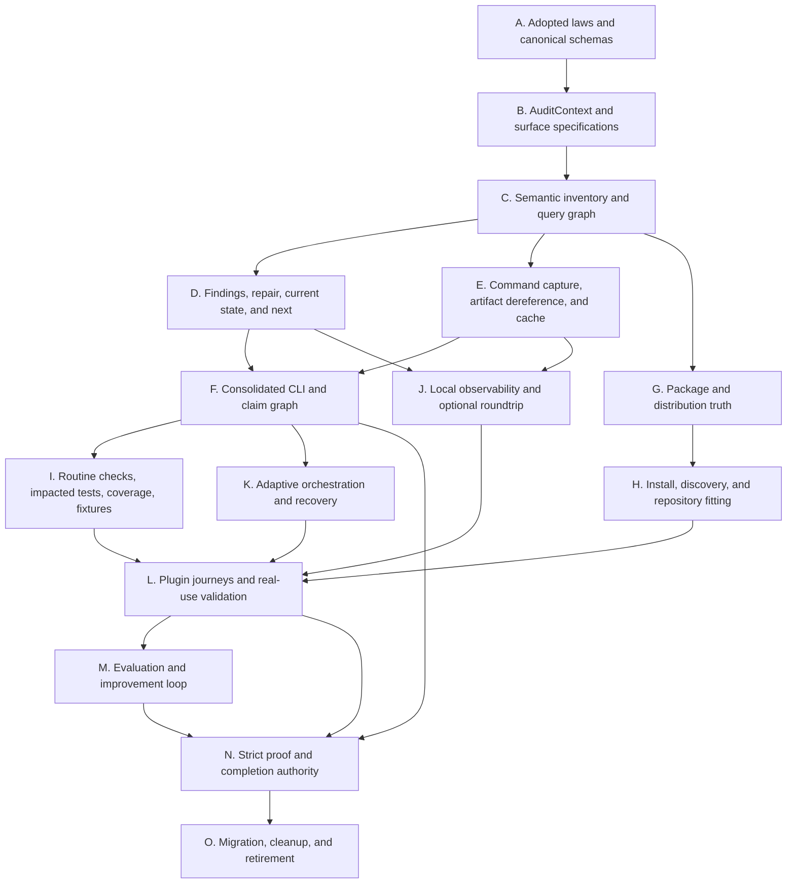

# Implementation Dependency Order

## Principle

This is a dependency order, not a fixed lane plan. The Ultra root agent instantiates only the work packages required by current repository state and recomputes them after each accepted change. Product-semantic dependencies remain stable even when package count, ownership, or parallelism changes.

## Dependency graph

## A — Contract adoption and canonical schemas

**Purpose:** independently review, revise, and explicitly adopt the successor laws before implementation uses them as authority.

Required outcomes:

- stable law, diagnostic, product-surface, effect, evidence, claim, work-package, worker-output, and acceptance schemas;
- one canonical requirement trace and source registry;
- generated-view ownership declared;
- legacy identifiers classified as aliases only.

Promotion criteria:

- GPT-5.6 Pro review findings dispositioned;
- no unresolved duplicate authority in the candidate;
- every binding law has complete trace fields;
- schema evolution and migration rules reviewed.

No worker may implement a claim-bearing surface against a draft schema that another worker can change concurrently.

## B — AuditContext and surface specifications

**Purpose:** establish immutable current inputs and applicability before more validators are added.

Implement:

- `AuditContext` builder and identity;
- product-surface input specifications;
- repository root, dirty state, toolchain, package/install/app/optional-surface identities;
- command effect boundary;
- congruence and invalidation primitives.

Proof:

- independent enumeration agreement;
- dirty/untracked/symlink/environment mutation fixtures;
- same inputs produce same identity; relevant change invalidates it.

## C — Semantic inventory and incremental query graph

**Purpose:** remove static inventory and affected-set duplication.

Implement:

- canonical component/law/command/schema/symbol/generated ownership inventory;
- product dependency edges;
- query-node identity and affected closure;
- conservative uncertainty expansion.

Proof:

- compiler/package comparison;
- known omission and dependency mutation corpus;
- full strict comparison detects no affected-set false negative in the promotion corpus.

## D — Findings, repair, current state, and next

**Purpose:** provide one operator and agent control surface early.

Implement:

- canonical `Finding` and `Repair` types;
- authority-graph state transitions;
- read-only `status` and `next` projections;
- deterministic priority and honest no-op/blocked behavior.

Proof:

- stable diagnostic IDs and exact reruns;
- contradictory receipt cannot change state;
- repeated `status`/`next` produces no filesystem or external mutation;
- operator comprehension review.

## E — Capture, dereference, and verified cache

**Purpose:** make observations trustworthy enough to use without making them self-authoritative.

Implement:

- structured command capture;
- typed evidence references and dereferencing;
- node-local content-addressed cache;
- atomicity, integrity, redaction, retention, and invalidation.

Proof:

- interruption, truncation, tamper, path, non-UTF8, collision, partial-write, tool-version, and transitive-input cases;
- cache hits compare to recomputation and are cheaper than it.

## F — Consolidated CLI and claim graph

**Purpose:** replace overlapping gate-era authority with the small successor interface.

Implement:

- conventional typed parser and effect-safe dependency injection;
- public command/exit/machine-output contract;
- one claim graph joining laws, surfaces, findings, evidence, reconciliation, and ceiling;
- compatibility aliases as non-authoritative filtered views.

Proof:

- parser/help/exit/effect fixtures;
- every legacy claim path maps to the same result for the same context;
- hidden-write test fails if any read-only command mutates.

## G — Package and distribution truth

**Purpose:** establish one reproducible package identity before install/discovery work.

Implement:

- generated plugin resource inventory;
- normalized package snapshot and archive comparison;
- version/provenance/integrity fields;
- source-to-package claim guard.

Proof:

- omission, extra file, private file, mode, link, generated drift, dependency, and archive tamper fixtures;
- clean independent build/extract comparison.

## H — Installation, discovery, and repository fitting

**Purpose:** close the plugin product boundary.

Potential parallel packages after G/F stabilize:

- install/cache/application identity adapters (`serial_external_state` for live mutation);
- fit inspect/plan engine;
- fit apply executor;
- fit verification and host-load probe;
- front-door skill and component consolidation.

Proof:

- source/package/install/cache/app/runtime ladder;
- fresh and retrofit repositories with user changes;
- wrong home, stale cache, duplicate version, partial install, rollback, and new-task discovery.

## I — Routine checks, test intelligence, and fixtures

**Purpose:** make ordinary development fast and honest.

Implement:

- routine affected-set selection;
- impacted-test mapping;
- strict/routine coverage separation;
- behavioral fixture metadata and isolated scheduler;
- elimination of embedded non-authoritative policy logic.

Proof:

- dirty-tree and partial-optional-surface journeys;
- mutation corpus compares routine to strict;
- no-cache strict coverage;
- leakage across filesystem, environment, process, port, cache, telemetry, and install state.

## J — Observability and repair roundtrip

**Purpose:** make failure legible without requiring a service stack.

Implement:

- stable semantic event conventions;
- bounded local event spool and query parser;
- explain/repair compiler linked to findings;
- OpenTelemetry export and optional backend adapters;
- privacy/redaction/retention controls.

Proof:

- known-fault causal queries;
- local emission/persistence/query reconciliation;
- optional exporter/backend roundtrip;
- wrong candidate, drop, duplicate, reorder, delay, redaction, and unavailable-backend cases.

The heavy development observability stack may be adapted here, but it does not block routine local correctness.

## K — Adaptive orchestration and recovery

**Purpose:** implement the Ultra work graph after core state and claim semantics stabilize.

Implement:

- state-derived package generation;
- safety classes and semantic conflict detection;
- worker output/root acceptance schemas;
- root reconciliation and invalidation;
- stale, blocked, drift, incomplete, conflict, and root-restart recovery.

Proof:

- adversarial orchestration scenario suite;
- no fixed historical lane IDs in generated plans;
- worker reports cannot raise claim authority;
- shared-authority changes serialize and invalidate correctly.

## L — Plugin journeys and real-use validation

**Purpose:** prove the integrated plugin and CLI as a product.

Implement/validate every applicable `PJ-*` journey in the plugin contract. Read-only journey review can parallelize; live install/application mutation is serialized.

Proof must include:

- intended-user entry without internal command knowledge;
- fresh and retrofit repositories;
- routine work on dirty state;
- diagnosis and exact repair;
- strict proof and orchestration recovery;
- upgrade/maintenance;
- at least one clean end-to-end acquisition-through-completion rehearsal.

## M — Evaluation and improvement loop

**Purpose:** turn product failures into validated improvements without self-certification.

Implement:

- failure harvest and taxonomy;
- evaluation-data quality audit;
- baseline/candidate comparison;
- negative controls and regression scope;
- independent promotion and rollback.

Proof:

- deliberately broken eval tasks are quarantined;
- candidate improvement reproduces on validated cases;
- adjacent product journeys do not regress;
- source improvement is not promoted as install/runtime improvement without those journeys.

## N — Strict proof and completion authority

**Purpose:** connect all claim contracts under the minimum-ceiling rule.

Implement:

- strict surface selectors and same-candidate freezing;
- independent reconciliation routing;
- integrated product-claim graph;
- completion stop, residual risk, and external release boundary.

Proof:

- full false-pass corpus in `07-PROOF-CLAIM-AND-EVIDENCE-CONTRACT.md`;
- independent GPT-5.6 Pro review or equivalent non-authoring review of the implemented candidate;
- root reproduces critical evidence and refuses one-lower-surface candidates.

## O — Migration, cleanup, and retirement

**Purpose:** remove old authority only after successor proof exists.

Order:

1. publish aliases and migration diagnostics;
2. run equivalence and user-journey comparisons;
3. switch canonical generation and command routing;
4. deprecate old surfaces for one version;
5. verify no active references or product dependencies;
6. execute explicit cleanup plan;
7. verify package/install/app/runtime absence of retired surfaces;
8. remove aliases in the next major contract version.

## Parallelism guidance

After stages A-C stabilize, disjoint plugin research, package fixtures, CLI UX tests, and observability semantics may proceed in parallel as read-only or disjoint-write packages. Shared schemas, manifests, command catalog, claim graph, and migration aliases remain serial. Live install/application work and destructive cleanup remain serial external-state operations.

The root should optimize the critical path, not agent utilization.

## Replanning triggers

Recompute dependency order when:

- a law or schema changes;
- current repository or package identity changes;
- a worker reveals hidden shared authority;
- routine/strict equivalence exposes an affected-set miss;
- independent review finds a false pass;
- host/plugin/model/tool behavior changes;
- an ecosystem primitive replaces planned custom work;
- a required surface becomes unavailable or newly available.

## Implementation claim ceiling

Completing an early stage proves only that stage’s named surface. No stage, work package, or agent count independently proves Harness Ultragoal complete. The integrated claim remains blocked until N and required journey proof are reconciled and O has no completion-bearing residue.
